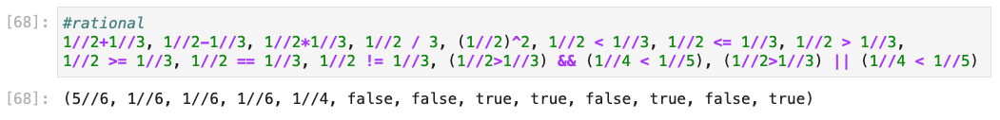

---
# Front matter
lang: ru-RU
title: "Лабораторная работа №1."
subtitle: "Julia. Установка и настройка. Основные принципы."
author: "Ишанова А.И. группа НФИ-02-19"

# Formatting
toc-title: "Содержание"

# Pdf output format
toc: true # Table of contents
toc_depth: 2
lof: true # List of figures
lot: false # List of tables
fontsize: 12pt
linestretch: 1.5
papersize: a4
documentclass: scrreprt
## I18n
polyglossia-lang:
  name: russian
  options:
	- spelling=modern
	- babelshorthands=true
polyglossia-otherlangs:
  name: english
### Fonts
mainfont: PT Serif
romanfont: PT Serif
sansfont: PT Sans
monofont: PT Mono
mainfontoptions: Ligatures=TeX
romanfontoptions: Ligatures=TeX
sansfontoptions: Ligatures=TeX,Scale=MatchLowercase
monofontoptions: Scale=MatchLowercase,Scale=0.9
## Biblatex
biblatex: true
biblio-style: "gost-numeric"
biblatexoptions:
  - parentracker=true
  - backend=biber
  - hyperref=auto
  - language=auto
  - autolang=other*
  - citestyle=gost-numeric
## Misc options
indent: true
header-includes:
  - \linepenalty=10 # the penalty added to the badness of each line within a paragraph (no associated penalty node) Increasing the value makes tex try to have fewer lines in the paragraph.
  - \interlinepenalty=0 # value of the penalty (node) added after each line of a paragraph.
  - \hyphenpenalty=50 # the penalty for line breaking at an automatically inserted hyphen
  - \exhyphenpenalty=50 # the penalty for line breaking at an explicit hyphen
  - \binoppenalty=700 # the penalty for breaking a line at a binary operator
  - \relpenalty=500 # the penalty for breaking a line at a relation
  - \clubpenalty=150 # extra penalty for breaking after first line of a paragraph
  - \widowpenalty=150 # extra penalty for breaking before last line of a paragraph
  - \displaywidowpenalty=50 # extra penalty for breaking before last line before a display math
  - \brokenpenalty=100 # extra penalty for page breaking after a hyphenated line
  - \predisplaypenalty=10000 # penalty for breaking before a display
  - \postdisplaypenalty=0 # penalty for breaking after a display
  - \floatingpenalty = 20000 # penalty for splitting an insertion (can only be split footnote in standard LaTeX)
  - \raggedbottom # or \flushbottom
  - \usepackage{float} # keep figures where there are in the text
  - \floatplacement{figure}{H} # keep figures where there are in the text
---

# Цель работы

Подготовить рабочее пространство и инструментарий для работы с языком программирования Julia, на простейших примерах познакомиться с основами синтаксиса Julia.

# Задание

1. Установите под свою операционную систему Julia, Jupyter.
2. Используя JupyterLab, повторите примеры из раздела 1.3.3.
3. Выполните задания для самостоятельной работы.[1]

# Теоретическое введение

Julia — высокоуровневый высокопроизводительный свободный язык программирования с динамической типизацией, созданный для математических вычислений. Эффективен также и для написания программ общего назначения. Синтаксис языка схож с синтаксисом других математических языков (например, MATLAB и Octave), однако имеет некоторые существенные отличия. Julia написан на Си, C++ и Scheme. Имеет встроенную поддержку многопоточности и распределённых вычислений, реализованные в том числе в стандартных конструкциях. [2]

Язык является динамическим, при этом поддерживает JIT-компиляцию (JIT-компилятор на основе LLVM входит в стандартный комплект), благодаря чему, по утверждению авторов языка, приложения, полностью написанные на языке (без использование низкоуровневых библиотек и векторных операций) практически не уступают в производительности приложениям, написанным на статически компилируемых языках, таких как Си или C++. Большая часть стандартной библиотеки языка написана на нём же. [2]

# Выполнение лабораторной работы

## Установка Julia и Jupyter

В ходе выполнения других курсов, мною уже была установлена Julia с IJulia для работы с Jupyter Notebook, поэтому этот пункт задания был мною опущен.

## Повторение примеров

1. Повторяем примеры с определением типа числовой величины. (@fig:001)

{ #fig:001 width=90%}

2. Потворяем примеры приведения аргументов к одному типу. (@fig:002)

{ #fig:002 width=90%}

3. Повторяем примеры определения функций. (@fig:003)

{ #fig:003 width=90%}

1. Повторяем примеры работы с массивами. (@fig:004)

{ #fig:004 width=90%}

## Задания для самостоятельной работы

1. Изучили документацию по основным функциям Julia для чтения / записи / вывода информации на экран: read(), readline(), readlines(), readdlm(), print(), println(), show(), write(). Привели свои примеры их использования. (@fig:005 - @fig:016)

{ #fig:005 width=90%}

{ #fig:006 width=89%}

{ #fig:007 width=90%}

{ #fig:008 width=90%}

{ #fig:009 width=90%}

{ #fig:010 width=90%}

{ #fig:011 width=90%}

{ #fig:012 width=90%}

{ #fig:013 width=90%}

{ #fig:014 width=90%}

{ #fig:015 width=90%}

{ #fig:016 width=90%}

1. Изучили документацию по функции parse(). Привели свой пример её использования. (@fig:017)

{ #fig:017 width=90%}

3. Изучили синтаксис Julia для базовых математических операций с разным типом переменных: сложение, вычитание, умножение, деление, возведение в степень, извлечение корня, сравнение, логические операции. Привели свои примеры. (@fig:018 - @fig:022)

{ #fig:018 width=100%}

{ #fig:019 width=100%}

{ #fig:020 width=100%}

{ #fig:021 width=100%}

{ #fig:022 width=100%}

4. Привели несколько своих примеров с операциями над матрицами и векторами: сложение, вычитание, скалярное произведение, транспонирование, умножение на скаляр. (@fig:023, @fig:024)

{ #fig:023 width=90%}

{ #fig:024 width=90%}

# Вывод

В ходе выполнения лабораторной работы на примерах были изучены основы синтаксиса в Julia.

# Библиография

1. Методические материалы курса.
2. Wikipedia: Julia (язык программирования). (https://ru.wikipedia.org/wiki/Julia_(%D1%8F%D0%B7%D1%8B%D0%BA_%D0%BF%D1%80%D0%BE%D0%B3%D1%80%D0%B0%D0%BC%D0%BC%D0%B8%D1%80%D0%BE%D0%B2%D0%B0%D0%BD%D0%B8%D1%8F)
