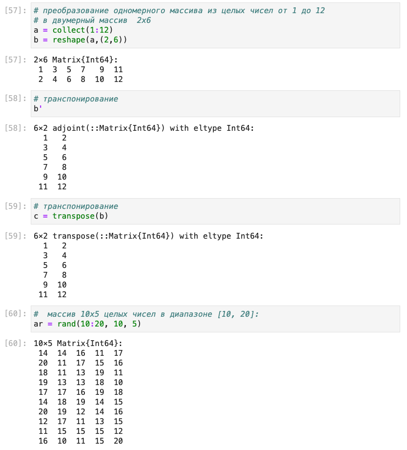
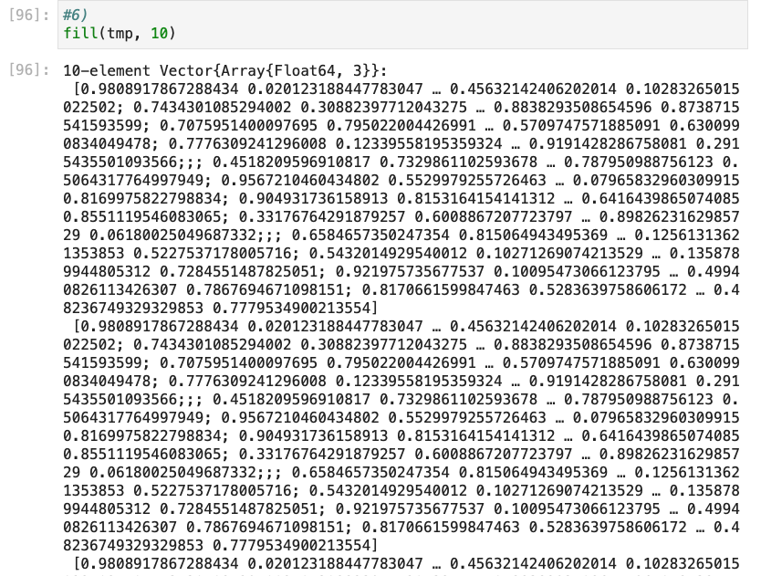

---
# Front matter
lang: ru-RU
title: "Лабораторная работа №2."
subtitle: "Структуры данных."
author: "Ишанова А.И. группа НФИ-02-19"

# Formatting
toc-title: "Содержание"

# Pdf output format
toc: true # Table of contents
toc_depth: 2
lof: true # List of figures
lot: false # List of tables
fontsize: 12pt
linestretch: 1.5
papersize: a4
documentclass: scrreprt
## I18n
polyglossia-lang:
  name: russian
  options:
	- spelling=modern
	- babelshorthands=true
polyglossia-otherlangs:
  name: english
### Fonts
mainfont: PT Serif
romanfont: PT Serif
sansfont: PT Sans
monofont: PT Mono
mainfontoptions: Ligatures=TeX
romanfontoptions: Ligatures=TeX
sansfontoptions: Ligatures=TeX,Scale=MatchLowercase
monofontoptions: Scale=MatchLowercase,Scale=0.9
## Biblatex
biblatex: true
biblio-style: "gost-numeric"
biblatexoptions:
  - parentracker=true
  - backend=biber
  - hyperref=auto
  - language=auto
  - autolang=other*
  - citestyle=gost-numeric
## Misc options
indent: true
header-includes:
  - \linepenalty=10 # the penalty added to the badness of each line within a paragraph (no associated penalty node) Increasing the value makes tex try to have fewer lines in the paragraph.
  - \interlinepenalty=0 # value of the penalty (node) added after each line of a paragraph.
  - \hyphenpenalty=50 # the penalty for line breaking at an automatically inserted hyphen
  - \exhyphenpenalty=50 # the penalty for line breaking at an explicit hyphen
  - \binoppenalty=700 # the penalty for breaking a line at a binary operator
  - \relpenalty=500 # the penalty for breaking a line at a relation
  - \clubpenalty=150 # extra penalty for breaking after first line of a paragraph
  - \widowpenalty=150 # extra penalty for breaking before last line of a paragraph
  - \displaywidowpenalty=50 # extra penalty for breaking before last line before a display math
  - \brokenpenalty=100 # extra penalty for page breaking after a hyphenated line
  - \predisplaypenalty=10000 # penalty for breaking before a display
  - \postdisplaypenalty=0 # penalty for breaking after a display
  - \floatingpenalty = 20000 # penalty for splitting an insertion (can only be split footnote in standard LaTeX)
  - \raggedbottom # or \flushbottom
  - \usepackage{float} # keep figures where there are in the text
  - \floatplacement{figure}{H} # keep figures where there are in the text
---

# Цель работы

Изучить несколько структур данных, реализованных в Julia, научиться применять их и операции над ними для решения задач.

# Задание

1. Используя Jupyter Lab, повторите примеры из раздела 2.2.
2. Выполните задания для самостоятельной работы (раздел2.4). [1]

# Теоретическое введение

Кортеж (Tuple) — структура данных (контейнер) в виде неизменяемой индексируемой последовательности элементов какого-либо типа (элементы индексируются с единицы).


Словарь — неупорядоченный набор связанных между собой по ключу данных.

Множество, как структура данных в Julia, соответствует множеству, как математическому объекту, то есть является неупорядоченной совокупностью элементов какого-либо типа. Возможные операции над множествами: объединение, пересечение, разность; принадлежность элемента множеству.

Массив — коллекция упорядоченных элементов, размещённая в многомерной сетке. Векторы и матрицы являются частными случаями массивов. [1]

# Выполнение лабораторной работы

## Повторение примеров

1. Повторяем примеры с кортежами. (@fig:001)

{ #fig:001 width=100%}

2. Потворяем примеры со словарями. (@fig:002)

{ #fig:002 width=100%}

3. Повторяем примеры с множествами. (@fig:003 - @fig:004)

{ #fig:003 width=100%}

{ #fig:004 width=100%}

4. Повторяем примеры работы с массивами. (@fig:005 - @fig:011)

{ #fig:005 width=100%}

{ #fig:006 width=100%}

{ #fig:007 width=100%}

{ #fig:008 width=100%}

{ #fig:009 width=100%}

{ #fig:010 width=100%}

{ #fig:011 width=100%}

## Задания для самостоятельной работы

1. Даны множества: A = {0,3,4,9}, B = {1,3,4,7}, C = {0,1,2,4,7,8,9}. Нашли $𝑃 =𝐴∩𝐵∪𝐴∩𝐵∪𝐴∩𝐶∪𝐵∩𝐶$. (@fig:012)

{ #fig:012 width=100%}

2. Привели свои примеры с выполнением операций над множествами элементов разных типов. (@fig:013 - @fig:014)

{ #fig:013 width=100%}

{ #fig:014 width=100%}

3. Создали разными способами:

   3.1. массив(1,2,3,...,N−1,N), c N = 21; (@fig:015)

    { #fig:015 width=100%}

   3.2. массив(N,N−1...,2,1), c N = 21; (@fig:016)

    { #fig:016 width=100%}

   3.3. массив(1,2,3,...,N−1,N,N−1,...,2,1), c N = 21;(@fig:017-@fig:018)

    { #fig:017 width=100%}

    { #fig:018 width=100%}

   3.4. массив с именем tmp вида (4,6,3); (@fig:019)

    { #fig:019 width=100%}

   3.5. массив, в котором первый элемент массива tmp повторяется 10 раз; (@fig:020)

    { #fig:020 width=100%}

   3.6. массив, в котором все элементы массива tmp повторяются 10 раз; (@fig:021-@fig:022)

    { #fig:021 width=100%}

    { #fig:022 width=100%}

   3.7. массив, в котором первый элемент массива tmp встречается 11 раз, второй элемент — 10 раз, третий элемент — 10 раз; (@fig:023-@fig:024)

    { #fig:023 width=100%}

    { #fig:024 width=100%}

   3.8. массив, в котором первый элемент массива tmp встречается 10 раз подряд, второй элемент — 20 раз подряд, третий элемент — 30 раз подряд; (@fig:025)

    { #fig:025 width=100%}

   3.9. массив из элементов вида $2^{tmp[i]}$ , i = 1, 2, 3, где элемент $2^{tmp[3]}$ встречается 4 раза; посчитали в полученном векторе, сколько раз встречается цифра 6; (@fig:026)

    ![Создание массива, из элементов вида $2^{tmp[i]}$ , i = 1, 2, 3, где элемент $2^{tmp[3]}$ встречается 4 раза; подсчет сколько раз встречается цифра 6 в этом векторе](pics/26.png){ #fig:026 width=100%}

   3.10. вектор значениий $y = e^x cos(x)$ в точках $x = 3,3.1,3.2,...,6$, нашли среднее значение y; (@fig:027)

    { #fig:027 width=100%}

   3.11. вектор вида $(x^i,y^j)$, $𝑥=0.1$, $i=3,6,9,...,36$, $y=0.2$, $j=1,4,7,...,34$; (@fig:028)
   
    { #fig:028 width=100%}
   
   3.12. вектор с элементами $\frac{2^i}{i}$, $𝑖i=1,2,...,M$ , $M=25$; (@fig:029)

    { #fig:029 width=100%}

   3.13. вектор вида (”fn1”,”fn2”,...,”fnN”) , N=30; (@fig:030)
   
    { #fig:030 width=100%}
   
   3.14. векторы $x=(X_1,x_2,...,X_n)$ и $y=(y_1,y_2,...,y_n)$ целочисленного типа длины n = 250, как случайные выборки из совокупности 0, 1, ... , 999; на его основе: (@fig:031-@fig:043)
    
    – сформировали вектор $(y_2 −x_1,...,y_n −x_n−1)$;

    { #fig:031 width=100%}

    - сформировали вектор $(x_1+2x_2-x_3, x_2+2x_3-x_4, ..., x_{n-2}+2x_{n-1}-x_n)$;

    { #fig:032 width=100%}

    - сформировали вектор $(\frac{sin(y_1)}{cos(x_2)}, \frac{sin(y_2)}{cos(x_2)}, ..., \frac{sin(y_{n-1})}{cos(x_n)})$;

    { #fig:033 width=100%}

    - вычислили $\sum_{i=1}^{n-1} \frac{e^{-x_{i+1}}}{x_i+10}$;

    { #fig:034 width=100%}

    - выбрали элементы вектора y, значения которых больше 600; определили индексы этих элементов;

    { #fig:035 width=100%}

    - определили значения вектора x, соответствующие значениям вектора y, значения которых больше 600 (под соответствием понимается расположение на аналогичных индексных позициях);

    { #fig:036 width=100%}

    - сформировали вектор $(|x_1 −\bar{x}|^{\frac{1}{2}} ,|x_2 −\bar{x}|^{\frac{1}{2}} ,...,|x_n −\bar{x}|^{\frac{1}{2}} )$, где $\bar{x}$ обозначает среднее значение вектора x

    { #fig:037 width=100%}

    - определили, сколько элементов вектора y отстоят от максимального значения не более, чем на 200;
  
    { #fig:038 width=100%}

    - определили, сколько чётных и нечётных элементов вектора x;

    { #fig:039 width=100%}

    - определили, сколько элементов вектора x кратны 7;

    { #fig:040 width=100%}

    - отсортировали элементы вектора x в порядке возрастания элементов вектора y;

    { #fig:041 width=100%}

    - вывели элементы вектора х, которые входят в десятку наибольших;

    { #fig:042 width=100%}

    - сформировали вектор, содержащий только уникальные (неповторяющиеся) элементы вектора х.

    { #fig:043 width=100%}

4. Создали массив squares, в котором хранятся квадраты всех целых чисел от 1 до 100. (@fig:044)

{ #fig:044 width=100%}

5. Сгенерировали массив myprimes, в котором хранятся первые 168 простых чисел. Определили 89-е наименьшее простое число. Получили срез массива с 89-го до 99-го элемента включительно, содержащий наименьшие простые числа. (@fig:045)

{ #fig:045 width=100%}

6. Вычислили следующие выражения: (@fig:046-@fig:048)

    6.1. $\sum_{i=10}^{100} (i^3+4i^2)$

    { #fig:046 width=100%}

    6.2. $\sum_{i=1}^{M} (\frac{2^i}{i}+\frac{3^i}{i^2})$, $M=25$

    { #fig:047 width=100%}

    6.3. $1+\frac{2}{3}+(\frac{2}{3}\frac{4}{5}+...+\frac{2}{3}\frac{4}{5}...\frac{38}{39}))$

    { #fig:048 width=100%}

# Листинг

```julia
# -*- coding: utf-8 -*-
# ---
# jupyter:
#   jupytext:
#     text_representation:
#       extension: .jl
#       format_name: light
#       format_version: '1.5'
#       jupytext_version: 1.14.1
#   kernelspec:
#     display_name: Julia 1.8.2
#     language: julia
#     name: julia-1.8
# ---

# пустой кортеж:
()

# кортеж из элементов типа String:
favoritelang = ("Python","Julia","R")

# кортеж из целых чисел:
x1 = (1, 2, 3)

# кортеж из элементов разных типов: 
x2 = (1, 2.0, "tmp")

# именованный кортеж:
x3 = (a=2, b=1+2)

# длина кортежа x2:
length(x2)

# обратиться к элементам кортежа x2:
x2[1], x2[2], x2[3]

# произвести какую-либо операцию (сложение)
# с вторым и третьим элементами кортежа x1:
с = x1[2] + x1[3]

# обращение к элементам именованного кортежа x3: 
x3.a, x3.b, x3[2]

# проверка вхождения элементов tmp и 0 в кортеж x2 
# (два способа обращения к методу in()):
in("tmp", x2), 0 in x2

# создать словарь с именем phonebook:
phonebook = Dict("Иванов И.И." => ("867-5309","333-5544"), 
    "Бухгалтерия" => "555-2368")

# вывести ключи словаря:
keys(phonebook)

# вывести значения элементов словаря:
values(phonebook)

# вывести заданные в словаре пары "ключ - значение":
pairs(phonebook)

# проверка вхождения ключа в словарь:
haskey(phonebook, "Иванов И.И.")

# добавить элемент в словарь:
phonebook["Сидоров П.С."] = "555-3344"

# удалить ключ и связанные с ним значения из словаря
pop!(phonebook, "Иванов И.И.")

# Объединение словарей (функция merge()):
a = Dict("foo" => 0.0, "bar" => 42.0);
b = Dict("baz" => 17, "bar" => 13.0);
merge(a, b), merge(b,a)

# создать множество из четырёх целочисленных значений:
A = Set([1, 3, 4, 5])

# создать множество из 11 символьных значений:
B = Set("abrakadabra")

# проверка эквивалентности двух множеств:
S1 = Set([1,2]);
S2 = Set([3,4]);
issetequal(S1,S2)

S3 = Set([1,2,2,3,1,2,3,2,1]); 
S4 = Set([2,3,1]); 
issetequal(S3,S4)

# объединение множеств:
C=union(S1,S2)

# пересечение множеств:
D = intersect(S1,S3)

# разность множеств:
E = setdiff(S3,S1)

# проверка вхождения элементов одного множества в другое:
issubset(S1,S4)

# добавление элемента в множество:
push!(S4, 99)

# удаление последнего элемента множества:
pop!(S4)

# создание пустого массива с абстрактным типом:
empty_array_1 = []

# создание пустого массива с конкретным типом: 
empty_array_2 = (Int64)[]

empty_array_3 = (Float64)[]

# вектор-столбец:
a = [1, 2, 3]

# вектор-строка:
b = [1 2 3]

# многомерные массивы (матрицы):
A = [[1, 2, 3] [4, 5, 6] [7, 8, 9]]

B = [[1 2 3]; [4 5 6]; [7 8 9]]

# одномерный массив из 8 элементов (массив $1 \times 8$)
# со значениями, случайно распределёнными на интервале [0, 1):
c = rand(1,8)

# многомерный массив $2 \times 3$ (2 строки, 3 столбца) элементов
# со значениями, случайно распределёнными на интервале [0, 1):
C = rand(2,3);

C

# трёхмерный массив:
D = rand(4, 3, 2)

# массив из квадратных корней всех целых чисел от 1 до 10:
roots = [sqrt(i) for i in 1:10]

# массив с элементами вида 3*x^2,
# где x - нечётное число от 1 до 9 (включительно)
ar_1 = [3*i^2 for i in 1:2:9]

# массив квадратов элементов, если квадрат не делится на 5 или 4:
ar_2=[i^2 for i=1:10 if (i^2%5!=0 && i^2%4!=0)]

# одномерный массив из пяти единиц:
ones(5)

# двумерный массив 2x3 из единиц:
ones(2,3)

# одномерный массив из 4 нулей:
zeros(4)

# заполнить массив 3x2 цифрами 3.5
fill(3.5,(3,2))

# заполнение массива посредством функции repeat():
repeat([1,2],3,3)
repeat([1 2],3,3)

# преобразование одномерного массива из целых чисел от 1 до 12
# в двумерный массив  2x6
a = collect(1:12)
b = reshape(a,(2,6))

# транспонирование
b'

# транспонирование
с = transpose(b)

#  массив 10x5 целых чисел в диапазоне [10, 20]:
ar = rand(10:20, 10, 5)

# выбор всех значений строки в столбце 2:
ar[:, 2]

# выбор всех значений в столбцах 2 и 5:
ar[:, [2, 5]]

# все значения строк в столбцах 2, 3 и 4:
ar[:, 2:4]

# значения в строках 2, 4, 6 и в столбцах 1 и 5:
ar[[2, 4, 6], [1, 5]]

# значения в строке 1 от столбца 3 до последнего столбца: 
ar[1, 3:end]

# сортировка по столбцам:
sort(ar,dims=1)

# сортировка по строкам:
sort(ar,dims=2)

# поэлементное сравнение с числом
# (результат - массив логических значений):
ar .> 14

# возврат индексов элементов массива, удовлетворяющих условию:
findall(ar .> 14)

# +
# ЗАДАНИЯ ДЛЯ САМОСТОЯТЕЛЬНОЙ РАБОТЫ

# +
#1.
A = Set([0, 3, 4, 9])
B = Set([1, 3, 4, 7])
C = Set([0, 1, 2, 4, 7, 8, 9])

AandB = intersect(A,B)
AandC = intersect(A,C)
BandC = intersect(B,C)

p1 = union(AandB, AandB)
p2 = union(p1, AandC)

P = union(p2, BandC)
# -

#2.
Q = Set([1, 2, 3, 4])
W = Set([1.0, 3.3, 7.6])
E = Set("qwerty")

issetequal(Q,W)

union(Q,W,E)

intersect(Q,W)

setdiff(Q,W)

issubset(Q,W)

push!(E, 'u')

pop!(E)

#3.
#1) N=21
[i for i in 1:21]

collect(1:21)

#2)
[i for i in 21:-1:1]

sort(collect(1:21), rev=true)

#3)
append!(collect(1:21), sort(collect(1:20), rev = true))

append!([i for i in 1:21], [j for j in 20:-1:1])

#4)
tmp = rand(4,6,3)

tmp = rand(4*6*3)
tmp = reshape(tmp, (4,6,3))

#5)
fill(tmp[1], 10)

repeat([tmp[1]], 10)

#6)
fill(tmp, 10)

repeat([tmp], 10)

#7)
append!(fill(tmp[1], 11), append!(fill(tmp[2], 10), fill(tmp[3], 10)))

append!(repeat([tmp[1]], 11), append!(repeat([tmp[2]], 10),
        repeat([tmp[3]], 10)))

append!(repeat([tmp[1], tmp[2], tmp[3]], 10), tmp[1])

#8)
append!(fill(tmp[1], 10), append!(fill(tmp[2], 20), fill(tmp[3], 30)))

append!(repeat([tmp[1]], 10), append!(repeat([tmp[2]], 20),
        repeat([tmp[3]], 30)))

#9)
ar2 = [2^tmp[i] for i in 1:3]
ar2 = append!(ar2, fill(2^tmp[3], 3))

ar2 = [2^tmp[i] for i in [1,2,3,3,3,3]]

# +
n = 0
for i in (1:length(ar2))
    t = ar2[i]
    k = 1
    if (trunc(Int,t)==0)
        k = 0
    end
    while(!(t%1==0))
        t = t*10
        k = k+1
    end
    t = trunc(Int,t)
    for i in (1:1:k)
        if (t%10==6)
            n = n+1
        end
        t = div(t, 10)
    end
end

n    
# -

#10)
y = [exp(i)*cos(i) for i in 3:0.1:6]

sum(y)/length(y)

# +
#11)
x = 0.1
y = 0.2

[[x^i y^(i-2)] for i in 3:3:36]
# -

#12)
M = 25
[2^i/i for i in 1:1:M]

#13)
N = 30
[string("fn", string(i)) for i in 1:N]

# + jupyter={"outputs_hidden": true} tags=[]
#14)
n = 250
x = rand(0:999, n)
y = rand(0:999, n)
# -

[y[i+1]-x[i] for i in 1:n-1]

[x[n-2]+2*x[n-1]-x[i] for i in 3:n]

[sin(y[i-1])/cos(x[i]) for i in 2:n]

s = 0
for i in 1:n-1
    s = s + exp(-x[i+1])/(x[i]+10)
end
s

y600 = [y[i] for i in 1:n if (y[i]>600)]

ind = findall(y .> 600)

[x[i] for i in ind]

avg_x = sum(x)/length(x)
[sqrt(abs(x[i]-avg_x)) for i=1:n]

y_avg = sum(y)/length(y)
length([y[i] for i=1:n if (abs(y[i]-y_avg)<=200 && y[i]<y_avg)])

even_x = length([x[i] for i=1:n if (x[i]%2==0)])
uneven_x = length([x[i] for i=1:n if (x[i]%2!=0)])
even_x, uneven_x

length([x[i] for i=1:n if (x[i]%7==0)])

y_sorted = sort!(y)
y_s_ind = [ indexin(y_sorted[i],y)[1] for i=1:n]
x_s = [x[i] for i in y_s_ind]

sort!(x, rev=true)[1:10]

unique(x)

#4)
squares = [i^2 for i=1:100]

#5)
using Primes
myprimes = [prime(i) for i=1:168]

myprimes[89]

myprimes[89:99]

# +
#6.

#1)
s = 0
for i=10:100
    s = s + i^3+4*i^2
end
s
# -

#2)
M = 25
s = 0
for i=1:M
    s = s + 2^i/i + 3^i/i^2
end
s

#3)
s = 1
t = 1
for i=2:2:38
    t = t * i / (i+1) 
    s = s + t
end
s

```

# Вывод

В ходе выполнения лабораторной работы на примерах были изучены создание и операции с кортежами, словарями, множествами и массивами. С помощью полученных знаний были решены задачи для самостоятельной работы.

# Библиография

1. Методические материалы курса.
