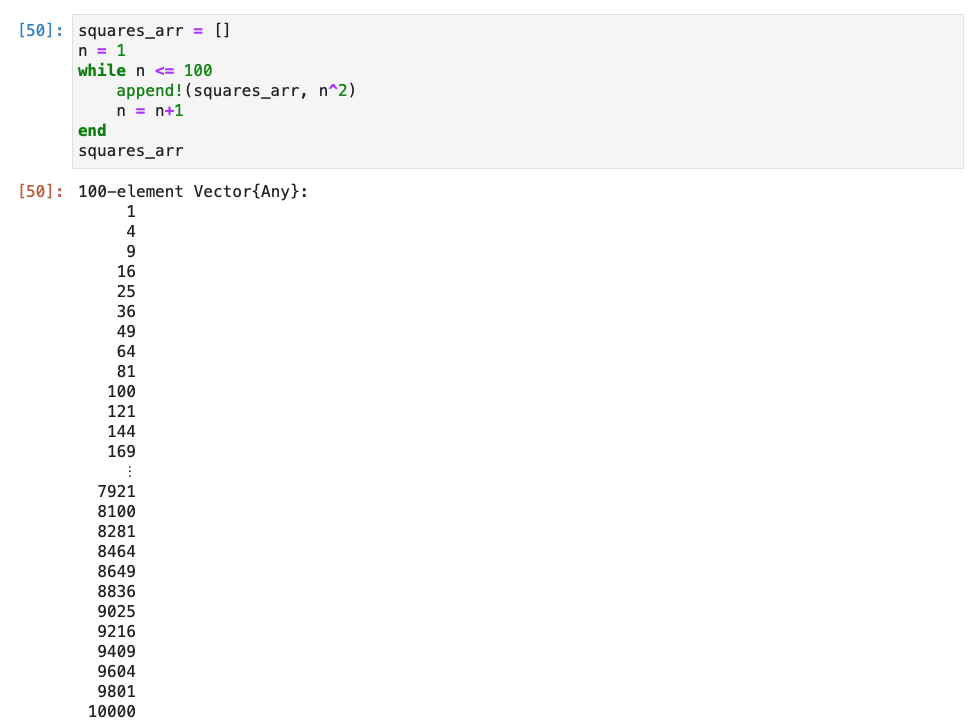
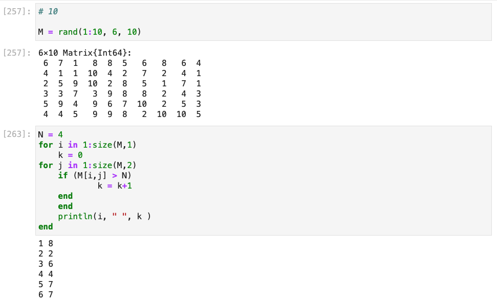

---
# Front matter
lang: ru-RU
title: "Лабораторная работа №3."
subtitle: "Управляющие структуры."
author: "Ишанова А.И. группа НФИ-02-19"

# Formatting
toc-title: "Содержание"

# Pdf output format
toc: true # Table of contents
toc_depth: 2
lof: true # List of figures
lot: false # List of tables
fontsize: 12pt
linestretch: 1.5
papersize: a4
documentclass: scrreprt
## I18n
polyglossia-lang:
  name: russian
  options:
	- spelling=modern
	- babelshorthands=true
polyglossia-otherlangs:
  name: english
### Fonts
mainfont: PT Serif
romanfont: PT Serif
sansfont: PT Sans
monofont: PT Mono
mainfontoptions: Ligatures=TeX
romanfontoptions: Ligatures=TeX
sansfontoptions: Ligatures=TeX,Scale=MatchLowercase
monofontoptions: Scale=MatchLowercase,Scale=0.9
## Biblatex
biblatex: true
biblio-style: "gost-numeric"
biblatexoptions:
  - parentracker=true
  - backend=biber
  - hyperref=auto
  - language=auto
  - autolang=other*
  - citestyle=gost-numeric
## Misc options
indent: true
header-includes:
  - \linepenalty=10 # the penalty added to the badness of each line within a paragraph (no associated penalty node) Increasing the value makes tex try to have fewer lines in the paragraph.
  - \interlinepenalty=0 # value of the penalty (node) added after each line of a paragraph.
  - \hyphenpenalty=50 # the penalty for line breaking at an automatically inserted hyphen
  - \exhyphenpenalty=50 # the penalty for line breaking at an explicit hyphen
  - \binoppenalty=700 # the penalty for breaking a line at a binary operator
  - \relpenalty=500 # the penalty for breaking a line at a relation
  - \clubpenalty=150 # extra penalty for breaking after first line of a paragraph
  - \widowpenalty=150 # extra penalty for breaking before last line of a paragraph
  - \displaywidowpenalty=50 # extra penalty for breaking before last line before a display math
  - \brokenpenalty=100 # extra penalty for page breaking after a hyphenated line
  - \predisplaypenalty=10000 # penalty for breaking before a display
  - \postdisplaypenalty=0 # penalty for breaking after a display
  - \floatingpenalty = 20000 # penalty for splitting an insertion (can only be split footnote in standard LaTeX)
  - \raggedbottom # or \flushbottom
  - \usepackage{float} # keep figures where there are in the text
  - \floatplacement{figure}{H} # keep figures where there are in the text
---

# Цель работы

Освоить применение циклов функций и сторонних для Julia пакетов для решения задач линейной алгебры и работы с матрицами.

# Задание

1. Используя Jupyter Lab, повторите примеры из раздела 3.2.
2. Выполните задания для самостоятельной работы (раздел 3.4). [1]

# Выполнение лабораторной работы

## Повторение примеров

1. Повторяем примеры с циклом while. (@fig:001 - @fig:002)

{ #fig:001 width=100%}

{ #fig:002 width=100%}

2. Повторяем примеры с циклом for. (@fig:003 - @fig:004)

{ #fig:003 width=100%}

{ #fig:004 width=100%}

3. Повторяем пример использования цикла for для создания двумерного массива, в котором значение каждой записи является суммой индексов строки и столбца. (@fig:005 - @fig:007)

{ #fig:005 width=100%}

{ #fig:006 width=100%}

{ #fig:007 width=100%}

4. Повторяем пример с условными выражениями. (@fig:008)

{ #fig:008 width=100%}

5. Повторяем пример с тернарным оператором. (@fig:009)

{ #fig:009 width=100%}

6. Повторяем примеры задания функции. (@fig:010)

{ #fig:010 width=100%}

7. Повторяем примеры функций с восклицательным знаком. (@fig:011)

{ #fig:011 width=100%}

8. Повторяем примеры с map(). (@fig:012)

{ #fig:012 width=100%}

9. Повторяем примеры с broadcast(). (@fig:013 - @fig:015)

{ #fig:013 width=100%}

{ #fig:014 width=100%}

{ #fig:015 width=100%}

10. Установка пакета Colors. (@fig:016)

{ #fig:016 width=100%}

11. Повторяем пример с палитрой и рандомной матрицей сэлементами-цветами. (@fig:017)

{ #fig:017 width=100%}


## Задания для самостоятельной работы

1. Используя циклы while и for:
    – вывели на экран целые числа от 1 до 100 и напечатали их квадраты (@fig:018-@fig:019);

    { #fig:018 width=100%}

    { #fig:019 width=100%}

    – создали словарь squares,который содержит целые числа в качестве ключей и квадраты в качестве их пар-значений (@fig:020-@fig:021);

    { #fig:020 width=100%}

    { #fig:021 width=100%}

    – создали массив squares_arr, содержащий квадраты всех чисел от 1 до 100 (@fig:022-@fig:023).

    { #fig:022 width=100%}

    { #fig:023 width=100%}

2. Написали условный оператор, который печатает число, если число чётное, и строку «нечётное», если число нечётное. Переписали код, используя тернарный оператор. (@fig:024)

{ #fig:024 width=100%}

3. Написали функцию add_one, которая добавляет 1 к своему входу. (@fig:025)

{ #fig:025 width=100%}

4. Использовали broadcast() для задания матрицы А, каждый элемент которой увеличивается на единицу по сравнению с предыдущим. (@fig:026)

{ #fig:026 width=100%}

5. Задали матрицу

$$
A = \begin{pmatrix}
1 & 1 & 3 \\
5 & 2 & 6 \\
-2 & -1 & -3
\end{pmatrix}
$$

   - нашли $A^3$  (@fig:027)
   - заменили третий столбец на сумму второго и третьего столбцов (@fig:027)

{ #fig:027 width=100%}

6. Создали матрицу $B$ с элементами $B_{i1}=10, B_{i2}=-10, B_{i3}=10, i = 1, 2, 3, ..., 15$. Нашли матрицу $C=B^TB$. (@fig:028)

{ #fig:028 width=100%}

7. Создали матрицу Z размерности 6×6,все элементы которой равны нулю, и матрицу
E, все элементы которой равны 1. Используя цикл while или for и закономерности расположения элементов, создали следующие матрицы размерности 6 × 6:

    - Z1 (@fig:029)

{ #fig:029 width=100%}

    - Z2 (@fig:030)

{ #fig:030 width=100%}

    - Z3 (@fig:031)

{ #fig:031 width=100%}

    - Z4 (@fig:032)

{ #fig:032 width=100%}

8. Написали свою функцию эквивалентную функции outer() в языке R. (@fig:033)

{ #fig:033 width=100%}

Используя нашу функцию outer(), задали следующие матрицы:

    - A1 (@fig:034)

{ #fig:034 width=100%}

   - A2 (@fig:035)

{ #fig:035 width=100%}

   - A3 (@fig:036)

{ #fig:036 width=100%}

   - A4 (@fig:037)

{ #fig:037 width=100%}

   - A5 (@fig:038)

{ #fig:038 width=100%}

9. Решили систему уравнений (@fig:039)

$$
\begin{cases}
x_1 +2x_2 +3x_3+4x_4+5x_5=7 \\
2x_1 +x_2 +2x_3+3x_4+4x_5=-1 \\
3x_1 +2x_2 +x_3+2x_4+3x_5=-3 \\
4x_1 +3x_2 +2x_3+x_4+2x_5=5 \\
5x_1 +4x_2 +3x_3+2x_4+x_5=17
\end{cases}
$$

{ #fig:039 width=100%}

10.  Создали матрицу M размерности 6×10, элементами которой являются целые числа, выбранные случайным образом с повторениями из совокупности 1, 2, ... , 10. (@fig:040)

- нашли число элементов в каждой строке матрицы, которые больше числа N=4 (@fig:040)

{ #fig:040 width=100%}

- определили в каких строках число M=7 встречается ровно 2 раза (таких нет, поэтому ничего не выводится) (@fig:041)

{ #fig:041 width=100%}

- определили все пары столбцов матрицы, сумма элементов которых больше K=75 (@fig:042)

{ #fig:042 width=100%}

11. Вычислили (@fig:043)

$$
\sum^{20}_{i=1}\sum^{5}_{j=1} \frac{i^4}{(3+j)}
$$

и

$$
\sum^{20}_{i=1}\sum^{5}_{j=1} \frac{i^4}{(3+ij)}
$$

{ #fig:043 width=100%}


# Листинг

```julia
# -*- coding: utf-8 -*-
# ---
# jupyter:
#   jupytext:
#     text_representation:
#       extension: .jl
#       format_name: light
#       format_version: '1.5'
#       jupytext_version: 1.14.1
#   kernelspec:
#     display_name: Julia 1.8.2
#     language: julia
#     name: julia-1.8
# ---

# пока n<10 прибавить к n единицу и распечатать значение:
n=0
while n < 10
n += 1
println(n)
end

myfriends = ["Ted", "Robyn", "Barney", "Lily", "Marshall"]

i=1
while i <= length(myfriends)
    friend = myfriends[i]
    println("Hi $friend, it's great to see you!")
    i += 1
end

for n in 1:2:10
    println(n)
end

myfriends = ["Ted", "Robyn", "Barney", "Lily", "Marshall"]
for friend in myfriends
    println("Hi $friend, it's great to see you!")
end

# инициализация массива m x n из нулей:
m, n = 5, 5
A = fill(0, (m, n))

# формирование массива, в котором значение каждой записи
# является суммой индексов строки и столбца:
for i in 1:m
    for j in 1:n
        A[i, j] = i + j
    end
end
A

# инициализация массива m x n из нулей:
B = fill(0, (m, n))
for i in 1:m, j in 1:n
    B[i, j] = i + j
end
B

C = [i + j for i in 1:m, j in 1:n]
C

# используем `&&` для реализации операции "AND"
# операция % вычисляет остаток от деления
N = 15
if (N % 3 == 0) && (N % 5 == 0)
    println("FizzBuzz")
elseif N % 3 == 0
    println("Fizz")
elseif N % 5 == 0
    println("Buzz")
else
    println(N)
end

N = 5
if (N % 3 == 0) && (N % 5 == 0)
    println("FizzBuzz")
elseif N % 3 == 0
    println("Fizz")
elseif N % 5 == 0
    println("Buzz")
else
    println(N)
end

N = 3
if (N % 3 == 0) && (N % 5 == 0)
    println("FizzBuzz")
elseif N % 3 == 0
    println("Fizz")
elseif N % 5 == 0
    println("Buzz")
else
    println(N)
end

N = 1
if (N % 3 == 0) && (N % 5 == 0)
    println("FizzBuzz")
elseif N % 3 == 0
    println("Fizz")
elseif N % 5 == 0
    println("Buzz")
else
    println(N)
end

# Пример использования тернарного оператора:
x=5
y = 10
(x > y) ? x : y

# +
function sayhi(name)
    println("Hi $name, it's great to see you!")
end

# функция возведения в квадрат:
function f(x)
    x^2
end
# -

sayhi("C-3PO")

f(42)

sayhi2(name) = println("Hi $name, it's great to see you!")
f2(x) = x^2

sayhi2("C-3PO")

f2(42)

sayhi3 = name -> println("Hi $name, it's great to see you!")
f3 = x -> x^2

sayhi3("C-3PO")

f3(42)

v = [3, 5, 2]
sort(v)
v

v = [3, 5, 2]
sort!(v)
v

f(x) = x^2
map(f, [1, 2, 3])

x -> x^3
map(x -> x^3, [1, 2, 3])

f(x) = x^2
broadcast(f, [1, 2, 3])

f.([1, 2, 3])

# Задаём матрицу A:
A = [i + 3*j for j in 0:2, i in 1:3]

# Вызываем функцию f возведения в квадрат
f(A)

B = f.(A)

A .+ 2 .* f.(A) ./ A

@. A + 2 * f(A) / A

broadcast(x -> x + 2 * f(x) / x, A)

using Colors
palette = distinguishable_colors(100)

# # rand(palette, 3, 3)

# +
# ЗАДАНИЯ ДЛЯ САМОСТОЯТЕЛЬНОГО ВЫПОЛНЕНИЯ

# +
# 1.

n = 1
while n<=100
    println("$n ", n^2)
    n = n+1
end

# -

# for n in 1:100
#     println("$n ", n^2)
# end

# for n in 1:100
#     println(n, " ", n^2)
# end

squares = Dict()
for i in 1:100
    squares[i] = i^2
end
pairs(squares)

n = 1
while n<=100
    squares[n] = n^2
    n = n+1
end
pairs(squares)

squares_arr = []
for i in 1:100
    append!(squares_arr, i^2)
end
squares_arr

# +
# 2

N = 2
if (N%2==0)
    println(N)
else
    println("нечётное")
end
# -

(N%2==0) ? println(N) : println("нечётное")

# +
# 3

function add_one(x)
    x+1
end

add_one(1)

# +
# 4

A = ones(5,5)
# -

for i in 1:5, j in 1:5
    A[i, j:5] = broadcast(add_one, A[i, j:5])
    if (i!=5 && j==5)
        A[i+1, :] = fill(A[i,5], (1,5))
    end
end
A

# +
# 5

A = [ [1, 5, -2] [1, 2, -1] [3, 6, -3]]
# -

A^3

A[:, 3] = A[:,2]+A[:,3]
A

# +
# 6

B = repeat([10 -10 10], 15)
# -

C = B' * B

# +
# 7

Z = zeros(6,6)
E = ones(6,6)

Z1 = zeros(6,6)

for i in 1:6, j in 1:6
    if (abs(i-j)==1)
        Z1[i,j] = E[i,j]
    end
end
Z1

# + tags=[]
Z2 = zeros(6,6)
for i in 1:6, j in 1:6
    if (abs(i-j)==2 || i==j)
        Z2[i,j] = E[i,j]
    end
end
Z2
# -

Z3 = zeros(6,6)
for i in 1:6, j in 1:6
    if (j == 7-i || j == 5-i || j == 9-i)
        Z3[i,j] = E[i,j]
    end
end
Z3

Z4 = zeros(6,6)
for i in 1:6, j in 1:6
    if (j == i || abs(i-j)==2 || abs(i-j)==4 )
        Z4[i,j] = E[i,j]
    end
end
Z4

#8
function outer(x,y,operation)
    res = zeros(size(x)[1], size(y)[2])
    for i in 1:size(x)[1], j in 1:size(y)[2], k in 1:size(x)[2]
        res[i,j]+=operation(x[i,k],y[k,j])
    end
    return res
end        

aa = collect(0:4)
aa = reshape(aa, (size(aa,1), size(aa,2)))

A1 = outer(aa, aa', +)

A2 = outer(aa, collect(1:5)', ^)

A3 = .%(outer(aa, aa',+),5)

bb = collect(0:9)
bb = reshape(bb, (size(bb,1), size(bb,2)))
A4 = .%(outer(bb, bb',+),10)

# +
cc = collect(0:8)
dd = collect(9:-1:1)
cc = reshape(cc, (size(cc,1), size(cc,2)))
dd = reshape(dd, (size(dd,1), size(dd,2)))

A5 = .%(outer(cc, dd', +),9)

# +
#9

A = [1 2 3 4 5; 2 1 2 3 4; 3 2 1 2 3; 4 3 2 1 2; 5 4 3 2 1]
# -

y = [ 7 -1 -3 5 17]

function solveSLAU(A,y)
    inv(A)*y
end

X = solveSLAU(A,y')

# +
# 10

M = rand(1:10, 6, 10)
# -

N = 4
for i in 1:size(M,1)
    k = 0
for j in 1:size(M,2)
    if (M[i,j] > N)
            k = k+1
    end
    end
    println(i, " ", k )
end

NM = 7
for i in 1:size(M,1)
    if (length(findall(M[i,:] .== NM))==2)
        println(i)
    end
end

K = 75
for i in 1:size(M,1)
    for u in i+1:size(M,1)
        if (sum(M[i,:]+M[u,:]) > K)
            println(i, " ", u)
        end
    end
end

# +
# 11

r1 = 0
for i in 1:20, j in 1:5
    r1 += i^4/(3+j)
end
r1
# -

r2 = 0
for i in 1:20, j in 1:5
    r2 += i^4/(3+i*j)
end
r2
```

# Вывод

В ходе выполнения лабораторной работы на примерах были изучены управляющие структуры, мы ознакомились с циклами for и while, условными операторами, тернарными операторами, функциями map() и broadcast(), способами написания своих функций и пакетом Colors на языке Julia. С помощью полученных знаний были решены задачи для самостоятельной работы.

# Библиография

1. Методические материалы курса.
