---
## Front matter
lang: ru-RU
title: Защита лабораторной работы №3. Управляющие структуры.
author: Ишанова А.И.
group: NI-402
institute: RUDN University, Moscow, Russian Federation
date: 26 ноября 2022

## Formatting
toc: false
slide_level: 2
theme: metropolis
header-includes: 
 - \metroset{progressbar=frametitle,sectionpage=progressbar,numbering=fraction}
 - '\makeatletter'
 - '\beamer@ignorenonframefalse'
 - '\makeatother'
aspectratio: 43
section-titles: true
---

# Прагматика выполнения лабораторной работы

- изучение некоторых управляющих структур в Julia
  - цикл while
  - цикл for
  - if-else
  - тернарный оператор
  - broadcast(), map()
  - создание собственных функций
- загрузка пакета Colors
- приобретения навыков работы с этими структурами

# Цель выполнения лабораторной работы

Освоить применение циклов функций и сторонних для Julia пакетов для решения задач линейной алгебры и работы с матрицами.

#  Выполнение лабораторной работы

## Повторение примеров

Задание 1. Повторение примеров из раздела 3.2.

1. Повторяем примеры с циклом while. (@fig:001 - @fig:002)

{ #fig:001 width=90%}

## Повторение примеров

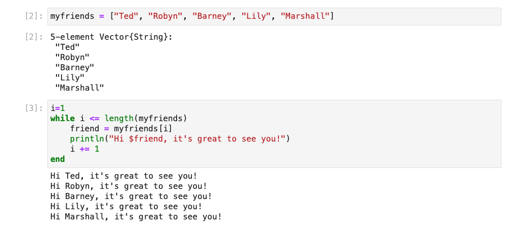{ #fig:002 width=90%}

## Повторение примеров

2. Повторяем примеры с циклом for. (@fig:003 - @fig:004)

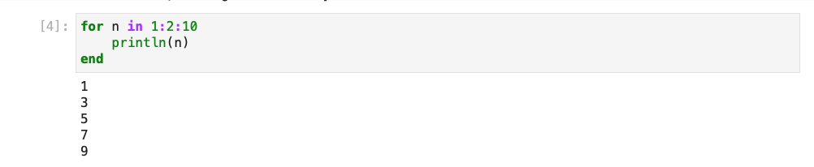{ #fig:003 width=100%}

## Повторение примеров

{ #fig:004 width=100%}

## Повторение примеров

3. Повторяем пример использования цикла for для создания двумерного массива, в котором значение каждой записи является суммой индексов строки и столбца. (@fig:005 - @fig:007)

{ #fig:005 width=80%}

## Повторение примеров

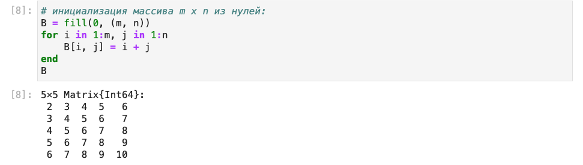{ #fig:006 width=100%}

## Повторение примеров

{ #fig:007 width=100%}

## Повторение примеров

4. Повторяем пример с условными выражениями. (@fig:008)

## Повторение примеров

{ #fig:008 width=65%}

## Повторение примеров

5. Повторяем пример с тернарным оператором. (@fig:009)

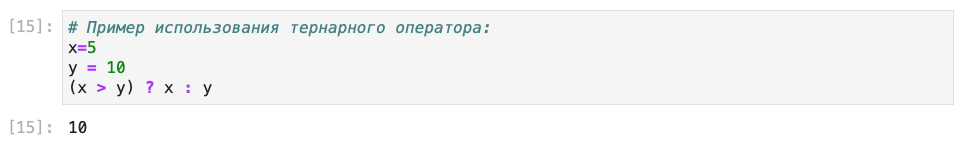{ #fig:009 width=100%}

## Повторение примеров

6. Повторяем примеры задания функции. (@fig:010)

{ #fig:010 width=65%}

## Повторение примеров

7. Повторяем примеры функций с восклицательным знаком. (@fig:011)

{ #fig:011 width=100%}

## Повторение примеров

8. Повторяем примеры с map(). (@fig:012)

{ #fig:012 width=100%}

## Повторение примеров

9. Повторяем примеры с broadcast(). (@fig:013 - @fig:015)

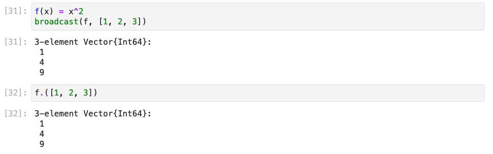{ #fig:013 width=100%}

## Повторение примеров

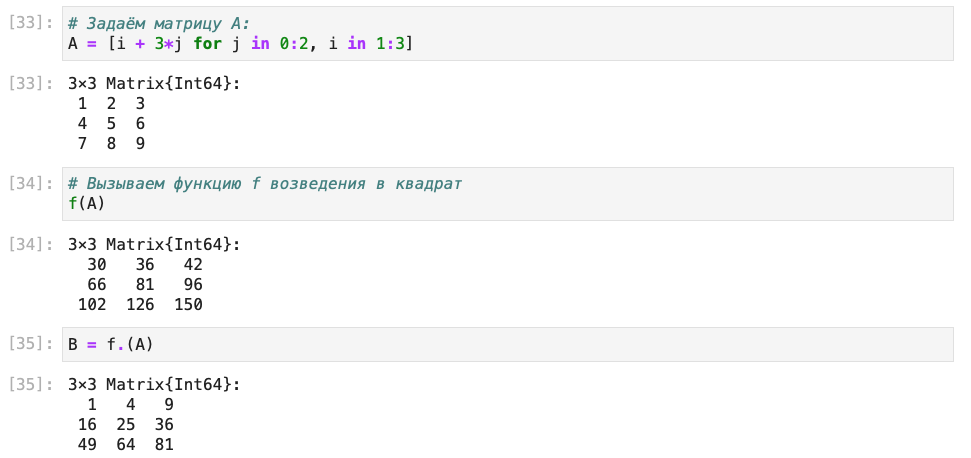{ #fig:014 width=100%}

## Повторение примеров

{ #fig:015 width=100%}

## Повторение примеров

10. Установка пакета Colors. (@fig:016)

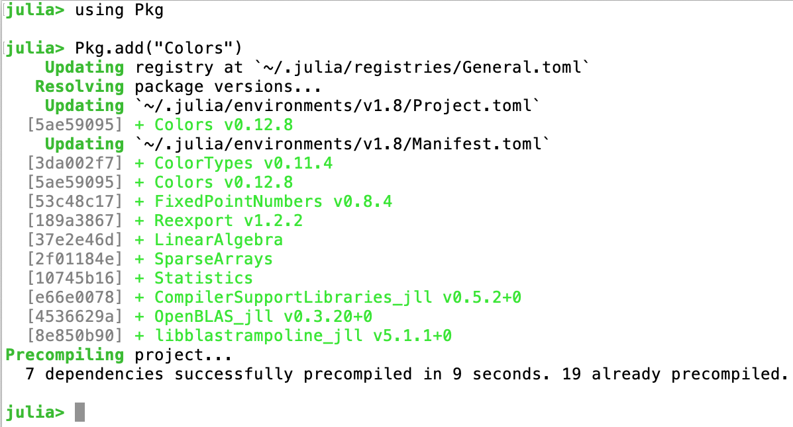{ #fig:016 width=100%}

## Повторение примеров

11. Повторяем пример с палитрой и рандомной матрицей с элементами-цветами. (@fig:017)

{ #fig:017 width=90%}

## Выполнения задания для самостоятельной работы - 1

1. Используя циклы while и for:
– вывели на экран целые числа от 1 до 100 и напечатали их квадраты (@fig:018-@fig:019);

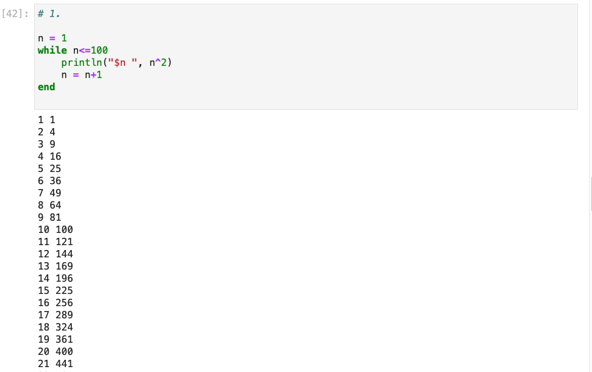{ #fig:018 width=90%}

## Выполнения задания для самостоятельной работы - 1

{ #fig:019 width=90%}

## Выполнения задания для самостоятельной работы - 1

– создали словарь squares,который содержит целые числа в качестве ключей и квадраты в качестве их пар-значений (@fig:020-@fig:021);

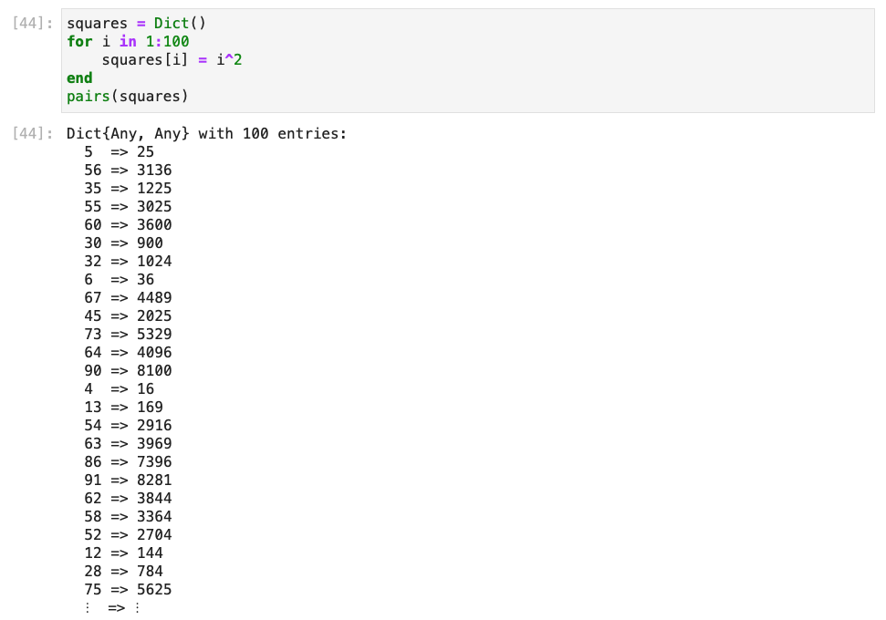{ #fig:020 width=80%}

## Выполнения задания для самостоятельной работы - 1

{ #fig:021 width=100%}

## Выполнения задания для самостоятельной работы - 1

– создали массив squares_arr, содержащий квадраты всех чисел от 1 до 100 (@fig:022-@fig:023).

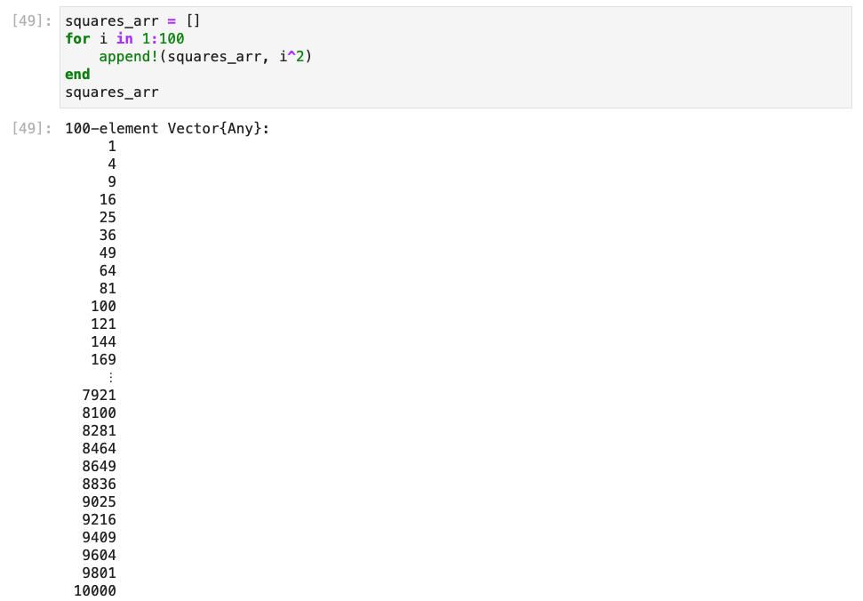{ #fig:022 width=80%}

## Выполнения задания для самостоятельной работы - 1

{ #fig:023 width=90%}

## Выполнения задания для самостоятельной работы - 2

2. Написали условный оператор, который печатает число, если число чётное, и строку «нечётное», если число нечётное. Переписали код, используя тернарный оператор. (@fig:024)

{ #fig:024 width=100%}

## Выполнения задания для самостоятельной работы - 3

3. Написали функцию add_one, которая добавляет 1 к своему входу. (@fig:025)

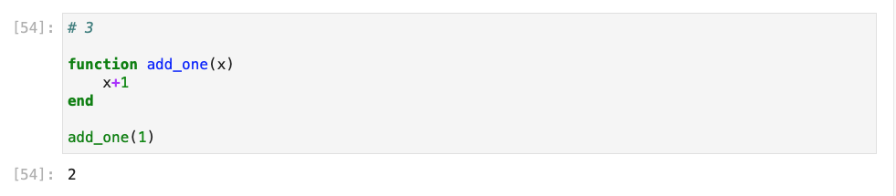{ #fig:025 width=100%}

## Выполнения задания для самостоятельной работы - 4

4. Использовали broadcast() для задания матрицы А, каждый элемент которой увеличивается на единицу по сравнению с предыдущим. (@fig:026)

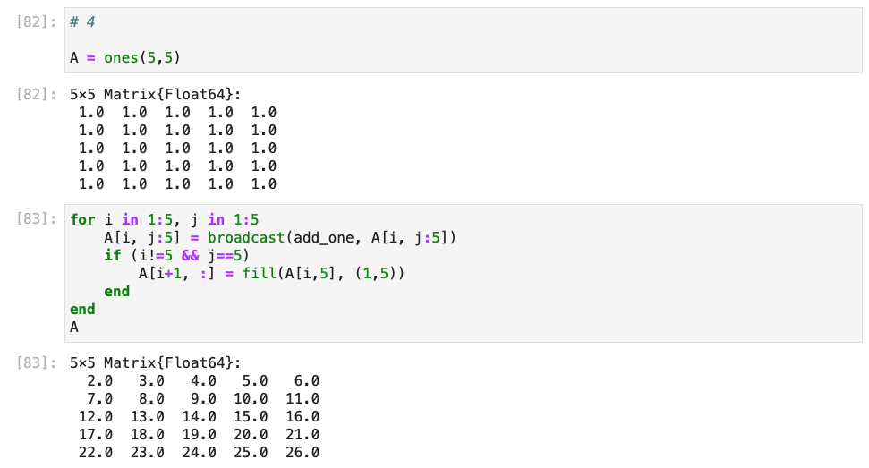{ #fig:026 width=100%}

## Выполнения задания для самостоятельной работы - 5

5. Задали матрицу

$$
A = \begin{pmatrix}
1 & 1 & 3 \\
5 & 2 & 6 \\
-2 & -1 & -3
\end{pmatrix}
$$

- нашли $A^3$  (@fig:027)
- заменили третий столбец на сумму второго и третьего столбцов (@fig:027)

## Выполнения задания для самостоятельной работы - 5

{ #fig:027 width=100%}

## Выполнения задания для самостоятельной работы - 6

6. Создали матрицу $B$ с элементами $B_{i1}=10, B_{i2}=-10, B_{i3}=10, i = 1, 2, 3, ..., 15$. Нашли матрицу $C=B^TB$. (@fig:028)

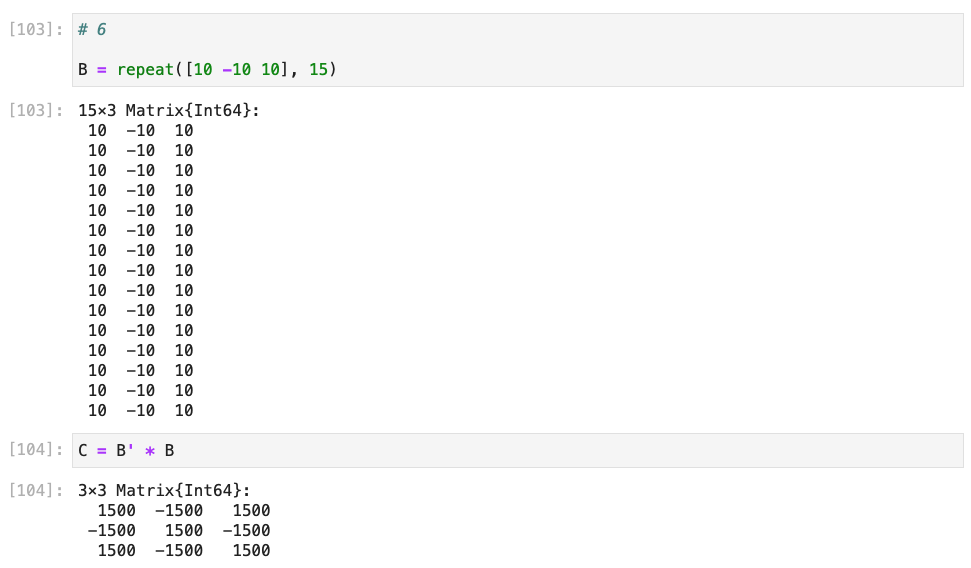{ #fig:028 width=90%}

## Выполнения задания для самостоятельной работы - 7

7. Создали матрицу Z размерности 6×6,все элементы которой равны нулю, и матрицу E, все элементы которой равны 1. Используя цикл while или for и закономерности расположения элементов, создали следующие матрицы размерности 6 × 6:

## Выполнения задания для самостоятельной работы - 7

{ #fig:029 width=100%}

## Выполнения задания для самостоятельной работы - 7

{ #fig:030 width=100%}

## Выполнения задания для самостоятельной работы - 7

{ #fig:031 width=100%}

## Выполнения задания для самостоятельной работы - 7

{ #fig:032 width=100%}

## Выполнения задания для самостоятельной работы - 8

8. Написали свою функцию эквивалентную функции outer() в языке R. (@fig:033)

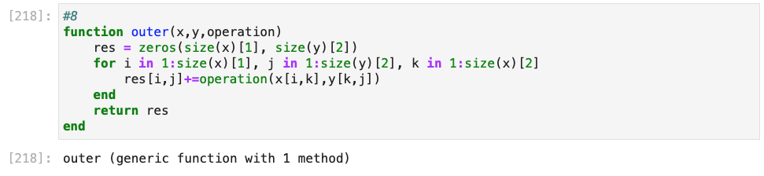{ #fig:033 width=100%}

## Выполнения задания для самостоятельной работы - 8

Используя нашу функцию outer(), задали следующие матрицы:

{ #fig:034 width=100%}

## Выполнения задания для самостоятельной работы - 8

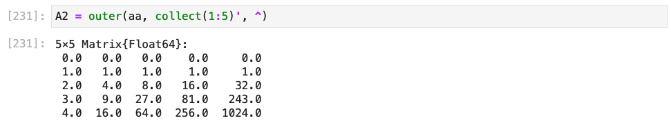{ #fig:035 width=100%}

## Выполнения задания для самостоятельной работы - 8

{ #fig:036 width=100%}

## Выполнения задания для самостоятельной работы - 8

{ #fig:037 width=100%}

## Выполнения задания для самостоятельной работы - 8

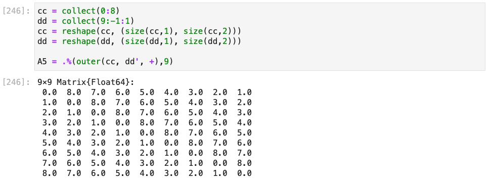{ #fig:038 width=100%}

## Выполнения задания для самостоятельной работы - 9

9. Решили систему уравнений (@fig:039)

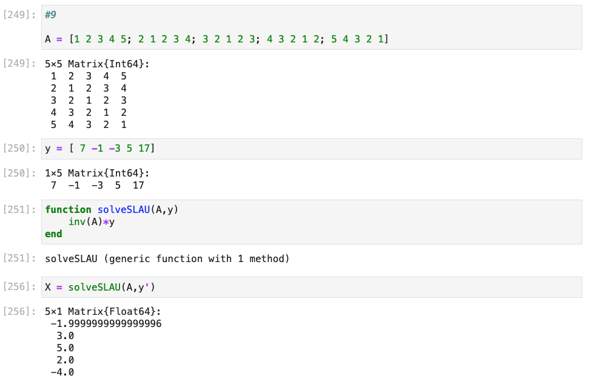{ #fig:039 width=95%}

## Выполнения задания для самостоятельной работы - 10

10.   Создали матрицу M размерности 6×10, элементами которой являются целые числа, выбранные случайным образом с повторениями из совокупности 1, 2, ... , 10. (@fig:040)

## Выполнения задания для самостоятельной работы - 10

{ #fig:040 width=100%}

## Выполнения задания для самостоятельной работы - 10

{ #fig:041 width=100%}

## Выполнения задания для самостоятельной работы - 10

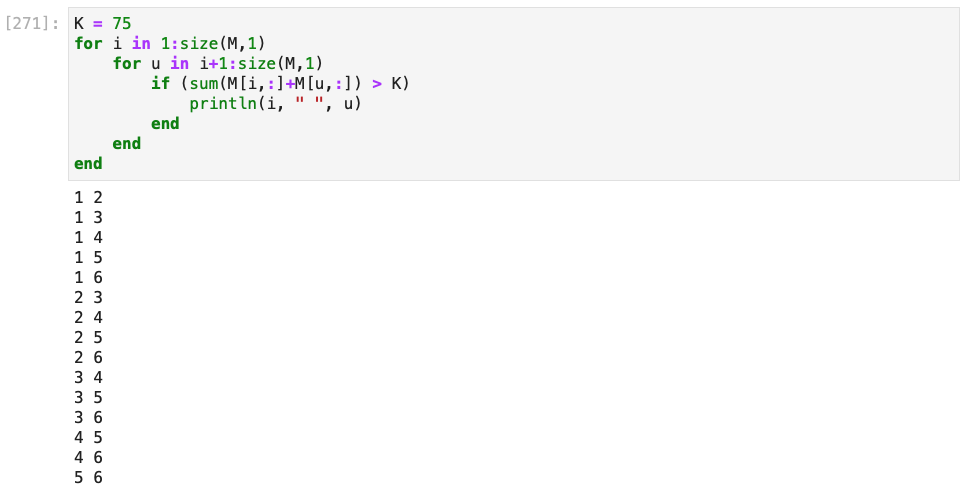{ #fig:042 width=100%}

## Выполнения задания для самостоятельной работы - 11

11. Вычислили (@fig:043)

$$
\sum^{20}_{i=1}\sum^{5}_{j=1} \frac{i^4}{(3+j)}
$$

и

$$
\sum^{20}_{i=1}\sum^{5}_{j=1} \frac{i^4}{(3+ij)}
$$

## Выполнения задания для самостоятельной работы - 11

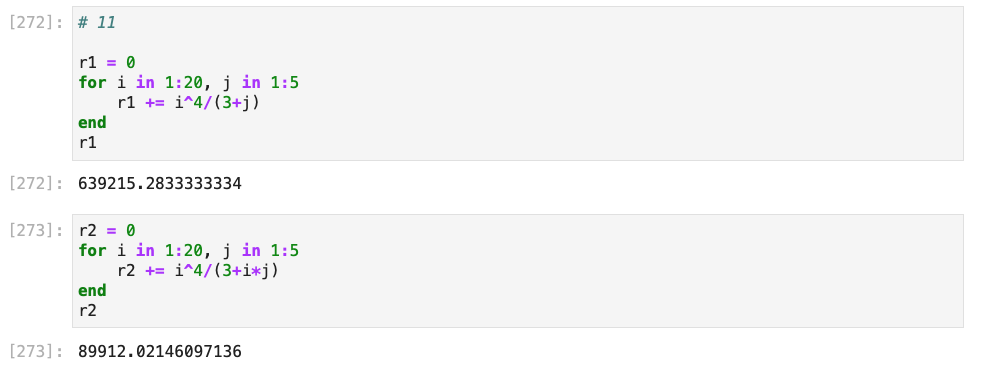{ #fig:043 width=100%}

# Результаты выполнения лабораторной работы

- ознакомились с:
  - циклами for и while
  - условными операторами
  - тернарными операторами
  - функциями map() и broadcast()
  - способами написания своих функций
  - пакетом Colors
- с помощью полученных знаний решили задания для самостоятельной работы
- получили файл с лабораторной в формате ipynb, который может быть использован в качестве референса для последующих работ на языке Julia