---
# Front matter
lang: ru-RU
title: "Лабораторная работа №4."
subtitle: "Линейная алгебра."
author: "Ишанова А.И. группа НФИ-02-19"

# Formatting
toc-title: "Содержание"

# Pdf output format
toc: true # Table of contents
toc_depth: 2
lof: true # List of figures
lot: false # List of tables
fontsize: 12pt
linestretch: 1.5
papersize: a4
documentclass: scrreprt
## I18n
polyglossia-lang:
  name: russian
  options:
	- spelling=modern
	- babelshorthands=true
polyglossia-otherlangs:
  name: english
### Fonts
mainfont: PT Serif
romanfont: PT Serif
sansfont: PT Sans
monofont: PT Mono
mainfontoptions: Ligatures=TeX
romanfontoptions: Ligatures=TeX
sansfontoptions: Ligatures=TeX,Scale=MatchLowercase
monofontoptions: Scale=MatchLowercase,Scale=0.9
## Biblatex
biblatex: true
biblio-style: "gost-numeric"
biblatexoptions:
  - parentracker=true
  - backend=biber
  - hyperref=auto
  - language=auto
  - autolang=other*
  - citestyle=gost-numeric
## Misc options
indent: true
header-includes:
  - \linepenalty=10 # the penalty added to the badness of each line within a paragraph (no associated penalty node) Increasing the value makes tex try to have fewer lines in the paragraph.
  - \interlinepenalty=0 # value of the penalty (node) added after each line of a paragraph.
  - \hyphenpenalty=50 # the penalty for line breaking at an automatically inserted hyphen
  - \exhyphenpenalty=50 # the penalty for line breaking at an explicit hyphen
  - \binoppenalty=700 # the penalty for breaking a line at a binary operator
  - \relpenalty=500 # the penalty for breaking a line at a relation
  - \clubpenalty=150 # extra penalty for breaking after first line of a paragraph
  - \widowpenalty=150 # extra penalty for breaking before last line of a paragraph
  - \displaywidowpenalty=50 # extra penalty for breaking before last line before a display math
  - \brokenpenalty=100 # extra penalty for page breaking after a hyphenated line
  - \predisplaypenalty=10000 # penalty for breaking before a display
  - \postdisplaypenalty=0 # penalty for breaking after a display
  - \floatingpenalty = 20000 # penalty for splitting an insertion (can only be split footnote in standard LaTeX)
  - \raggedbottom # or \flushbottom
  - \usepackage{float} # keep figures where there are in the text
  - \floatplacement{figure}{H} # keep figures where there are in the text
---

# Цель работы

Изучение возможностей специализированных пакетов Julia для выполнения и оценки эффективности операций над объектами линейной алгебры.

# Задание

1. Используя Jupyter Lab, повторите примеры из раздела 4.2.
2. Выполните задания для самостоятельной работы (раздел 4.4). [1]

# Выполнение лабораторной работы

## Повторение примеров

1. Повторяем примеры с поэлементными операциями над многомерными массивами. (@fig:001 - @fig:002)

{ #fig:001 width=100%}

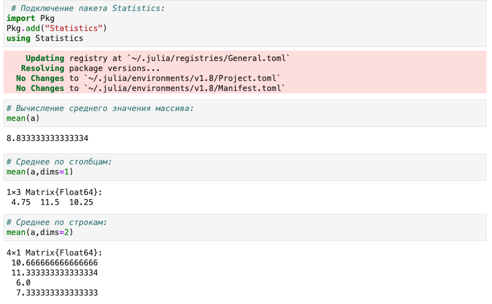{ #fig:002 width=100%}

2. Повторяем примеры с операциями над матрицами с пакетом LinearAlgebra (@fig:003 - @fig:004)

{ #fig:003 width=100%}

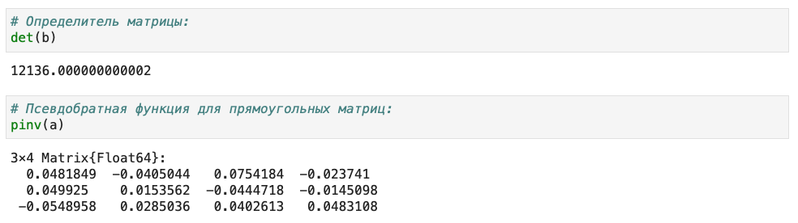{ #fig:004 width=100%}

3. Повторяем примеры из раздела "Вычисление нормы векторов и матриц, повороты, вращения". (@fig:005 - @fig:007)

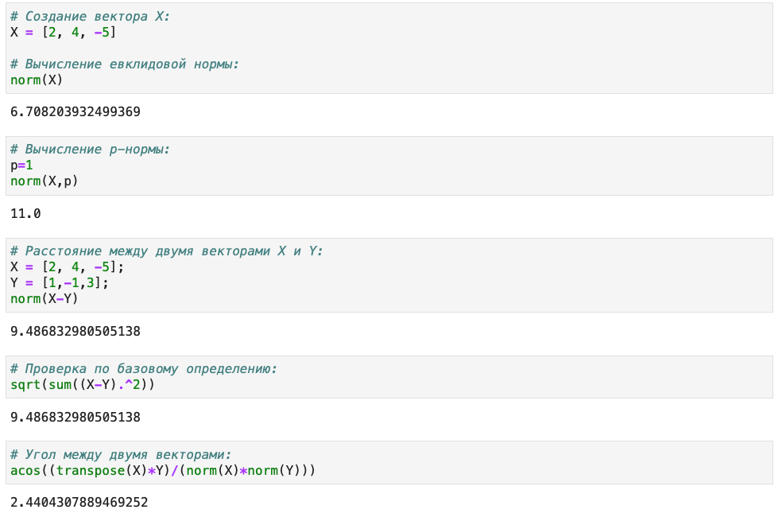{ #fig:005 width=100%}

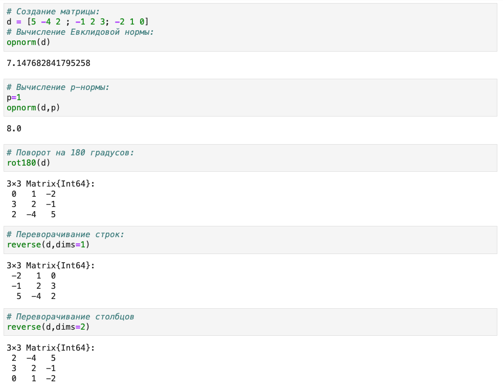{ #fig:006 width=100%}

4. Повторяем примеры из раздела "Матричное умножение, единичная матрица, скалярное произведение". (@fig:007)

{ #fig:007 width=100%}

5. Повторяем примеры из раздела "Факторизация. Специальные матричные структуры". (@fig:008 - @fig:017)

{ #fig:008 width=100%}

{ #fig:009 width=100%}

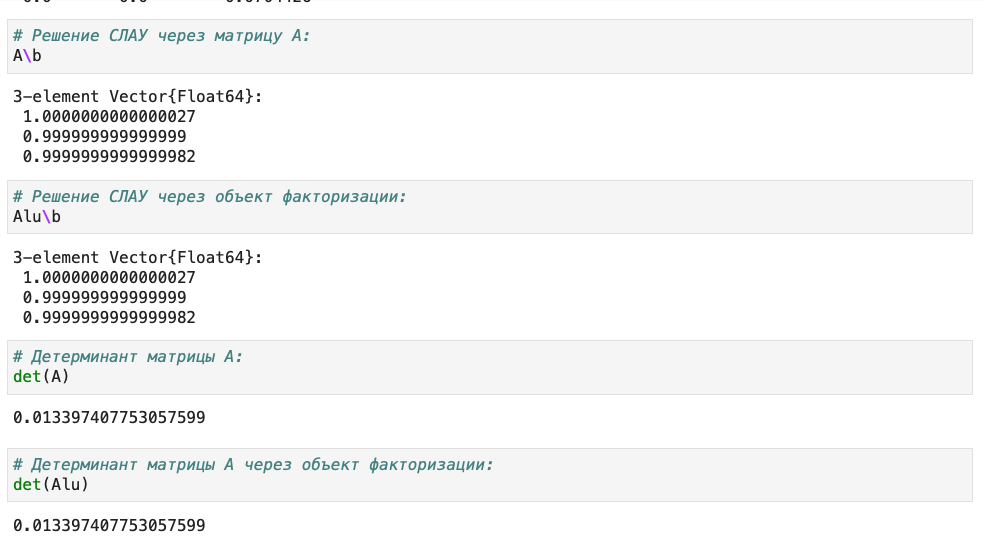{ #fig:010 width=100%}

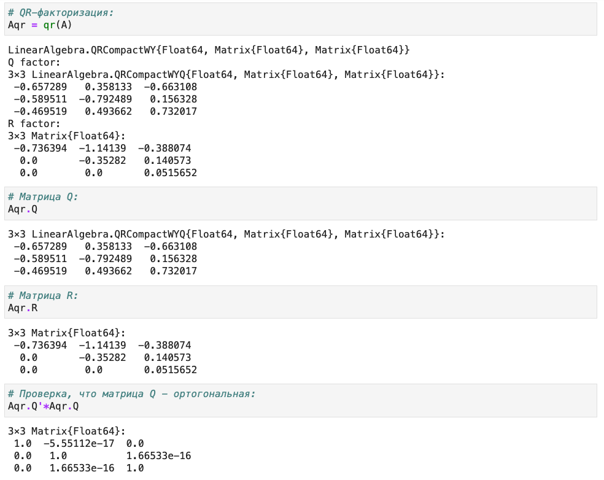{ #fig:011 width=100%}

{ #fig:012 width=100%}

{ #fig:013 width=100%}

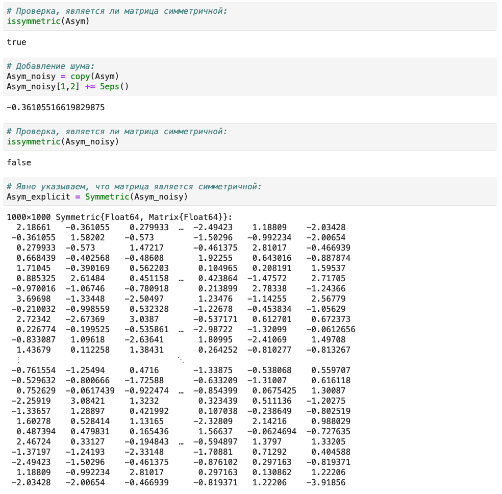{ #fig:014 width=100%}

{ #fig:015 width=100%}

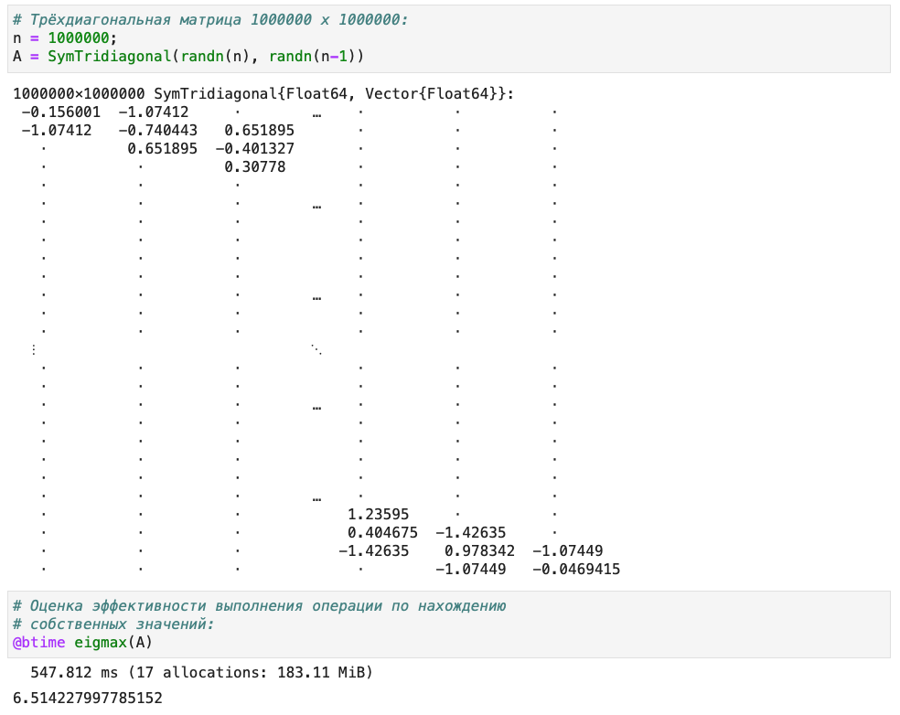{ #fig:016 width=100%}

{ #fig:017 width=100%}

6.  Повторяем примеры из раздела "Общая линейная алгебра". (@fig:018)

{ #fig:018 width=100%}


## Задания для самостоятельной работы

1. Призведение векторов.

1.1. Задайте вектор v. Умножьте вектор v скалярно сам на себя и сохраните результат в dot_v. (@fig:019)

1.2. Умножьте v матрично на себя (внешнее произведение), присвоив результат переменной outer_v. (@fig:019)

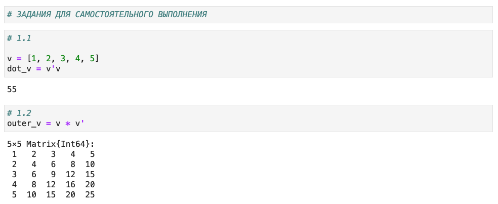{ #fig:019 width=100%}

2. Системы линейных уравнений.

2.1. Решить СЛАУ с двумя неизвестными.

a) (@fig:020)
$$
\begin{cases}
x+y = 2, \\
x-y=3.
\end{cases}
$$

b) Система имеет бесконечно много решений, поэтому программа выдает ошибку. (@fig:020)
$$
\begin{cases}
x+y = 2, \\
2x+2y=4.
\end{cases}
$$

c) Система не имеет решений, поэтому программа выдает ошибку. (@fig:020)
$$
\begin{cases}
x+y = 2, \\
2x+2y=5.
\end{cases}
$$

d) (@fig:021)
$$
\begin{cases}
x+y = 1, \\
2x+2y=2, \\
3x+3y=3.
\end{cases}
$$

e) (@fig:021)
$$
\begin{cases}
x+y = 2, \\
2x+y=1, \\
x-y=3.
\end{cases}
$$

f) (@fig:021)
$$
\begin{cases}
x+y = 2, \\
2x+y=1, \\
3x+2y=3.
\end{cases}
$$

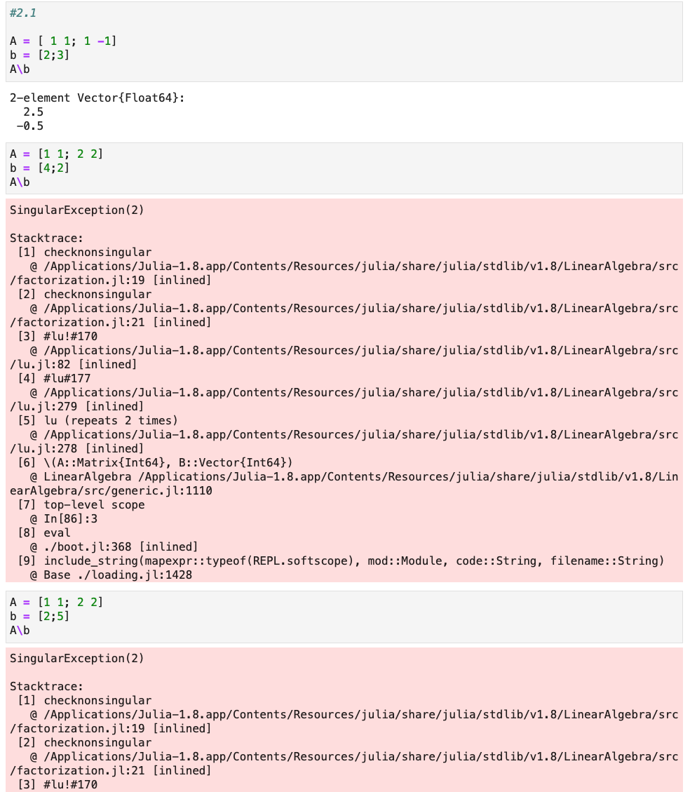{ #fig:020 width=100%}

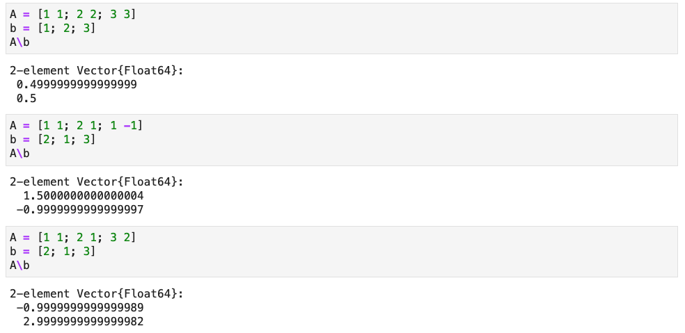{ #fig:021 width=100%}

2.2. Решить СЛАУ с тремя неизвестными.

a) (@fig:022)
$$
\begin{cases}
x+y+z = 2, \\
x-y-2z=3.
\end{cases}
$$

b) (@fig:022)
$$
\begin{cases}
x+y+z = 2, \\
2x+2y-3z=4, \\
3x+y+z=1.
\end{cases}
$$

c) Система имеет бесконечно много решений, поэтому программа выдает ошибку.(@fig:022)
$$
\begin{cases}
x+y+z = 1, \\
x+y+2z=0, \\
2x+2y+3z=1.
\end{cases}
$$

d) Система не имеет решений, поэтому программа выдает ошибку. (@fig:023)
$$
\begin{cases}
x+y+z = 1, \\
x+y+2z=0, \\
2x+2y+3z=0.
\end{cases}
$$

{ #fig:022 width=100%}

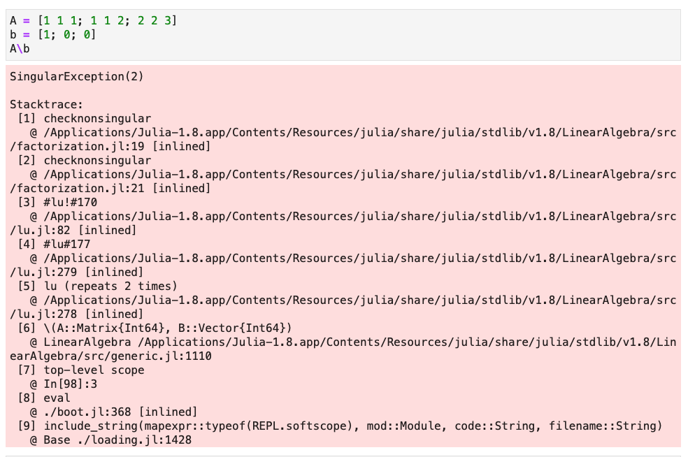{ #fig:023 width=100%}

3. Операции с матрицами.

3.1. Приведите матрицы к диагональному виду.

a) (@fig:024)
$$
\begin{pmatrix}
1 & -2 \\
-2 & 1
\end{pmatrix}
$$

b) (@fig:024)
$$
\begin{pmatrix}
1 & -2 \\
-2 & 3
\end{pmatrix}
$$

c) (@fig:024)
$$
\begin{pmatrix}
1 & -2 & 0\\
-2 & 1 & 2 \\
0 & 2 & 0
\end{pmatrix}
$$

{ #fig:024 width=100%}

3.2. Вычислить:

a) (@fig:025)
$$
\begin{pmatrix}
1 & -2 \\
-2 & 1
\end{pmatrix} ^{10}
$$

b) (@fig:025)
$$
\sqrt{
\begin{pmatrix}
5 & -2 \\
-2 & 5
\end{pmatrix} }
$$

c) (@fig:025)
$$
\sqrt[3]{
\begin{pmatrix}
1 & -2 \\
-2 & 1
\end{pmatrix} }
$$

d) (@fig:025)
$$
\sqrt{
\begin{pmatrix}
1 & 2 \\
2 & 3
\end{pmatrix} }
$$

{ #fig:025 width=100%}

3.3. Найти собственные значения, создать диагональную матрицу из собственных значений и нижнедиагональную матрицу из исходной, оценить эффективность выполнения операций. (@fig:026)

$$
A = 
\begin{pmatrix}
140 & 97 & 74 & 168 & 131 \\
97 & 106 & 89 & 131 & 36 \\
74 & 89 & 152 & 144 & 71 \\
168 & 131 & 144 & 54 & 142 \\
131 & 36 & 71 & 142 & 36
\end{pmatrix}
$$

{ #fig:026 width=100%}

4. Линейные модели экономики. 

Линейная модель:

$$ x- Ax = y$$

Проверить являются ли матрицы A продуктивными по критерию:

4.1. Критерий: Решение системы х при любом неотрицательном y имеет только неотрицательные элементы.

a) (@fig:027)
$$
\begin{pmatrix}
1 & 2 \\
3 & 4
\end{pmatrix}
$$

b)(@fig:027)
$$ \frac{1}{2}
\begin{pmatrix}
1 & 2 \\
3 & 4
\end{pmatrix}
$$

c)(@fig:027)
$$ \frac{1}{10}
\begin{pmatrix}
1 & 2 \\
3 & 4
\end{pmatrix}
$$

{ #fig:027 width=100%}

4.2. Все элементы матрицы $(E-A)^{-1}$ - неотрицательные числа.

a) (@fig:028)
$$
\begin{pmatrix}
1 & 2 \\
3 & 1
\end{pmatrix}
$$

b)(@fig:028)
$$ \frac{1}{2}
\begin{pmatrix}
1 & 2 \\
3 & 1
\end{pmatrix}
$$

c)(@fig:028)
$$ \frac{1}{10}
\begin{pmatrix}
1 & 2 \\
3 & 1
\end{pmatrix}
$$

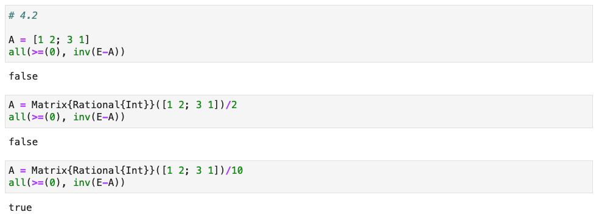{ #fig:028 width=100%}

4.3. Все собственные значения матрицы А по модулю меньше 1.

a) (@fig:029)
$$
\begin{pmatrix}
1 & 2 \\
3 & 1
\end{pmatrix}
$$

b)(@fig:029)
$$ \frac{1}{2}
\begin{pmatrix}
1 & 2 \\
3 & 1
\end{pmatrix}
$$

c)(@fig:029)
$$ \frac{1}{10}
\begin{pmatrix}
1 & 2 \\
3 & 1
\end{pmatrix}
$$

d)(@fig:029)
$$
\begin{pmatrix}
0.1 & 0.2 & 0.3 \\
0 & 0.1 & 0.2 \\
0 & 0.1 & 0.3
\end{pmatrix}
$$

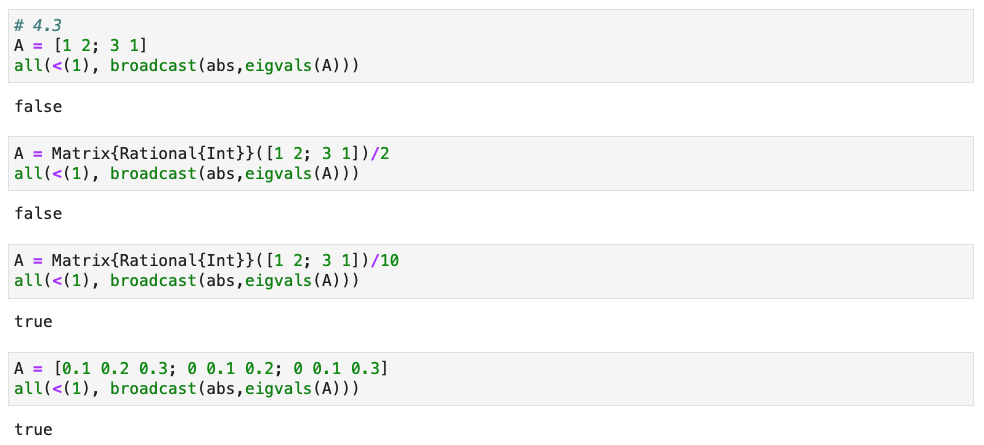{ #fig:029 width=100%}


# Листинг

```julia
# -*- coding: utf-8 -*-
# ---
# jupyter:
#   jupytext:
#     text_representation:
#       extension: .jl
#       format_name: light
#       format_version: '1.5'
#       jupytext_version: 1.14.1
#   kernelspec:
#     display_name: Julia 1.8.2
#     language: julia
#     name: julia-1.8
# ---

# Массив 4x3 со случайными целыми числами (от 1 до 20):
  a = rand(1:20,(4,3))

# Поэлементная сумма:
sum(a)

# Поэлементная сумма по столбцам:
sum(a,dims=1)

# Поэлементная сумма по строкам:
sum(a,dims=2)

# Поэлементное произведение:
prod(a)

# Поэлементное произведение по столбцам:
prod(a,dims=1)

# Поэлементное произведение по строкам:
prod(a,dims=2)

 # Подключение пакета Statistics:
import Pkg
Pkg.add("Statistics")
using Statistics

# Вычисление среднего значения массива:
mean(a)

# Среднее по столбцам:
mean(a,dims=1)

# Среднее по строкам:
mean(a,dims=2)

# Подключение пакета LinearAlgebra:
import Pkg
Pkg.add("LinearAlgebra")
using LinearAlgebra

# Массив 4x4 со случайными целыми числами (от 1 до 20):
b = rand(1:20,(4,4))

# Транспонирование:
transpose(b)

# След матрицы (сумма диагональных элементов):
tr(b)

# Извлечение диагональных элементов как массив:
diag(b)

# Ранг матрицы:
rank(b)

# Инверсия матрицы (определение обратной матрицы):
inv(b)

# Определитель матрицы:
det(b)

# Псевдобратная функция для прямоугольных матриц:
pinv(a)

# +
# Создание вектора X:
X = [2, 4, -5]

# Вычисление евклидовой нормы:
norm(X)
# -

# Вычисление p-нормы:
p=1
norm(X,p)

# Расстояние между двумя векторами X и Y:
X = [2, 4, -5];
Y = [1,-1,3];
norm(X-Y)

# Проверка по базовому определению:
sqrt(sum((X-Y).^2))

# Угол между двумя векторами:
acos((transpose(X)*Y)/(norm(X)*norm(Y)))

# Создание матрицы:
d = [5 -4 2 ; -1 2 3; -2 1 0]
# Вычисление Евклидовой нормы:
opnorm(d)

# Вычисление p-нормы:
p=1
opnorm(d,p)

# Поворот на 180 градусов:
rot180(d)

# Переворачивание строк:
reverse(d,dims=1)

# Переворачивание столбцов
reverse(d,dims=2)

# Матрица 2x3 со случайными целыми значениями от 1 до 10:
A = rand(1:10,(2,3))

# Матрица 3x4 со случайными целыми значениями от 1 до 10:
B = rand(1:10,(3,4))

# Произведение матриц A и B:
A*B

# Единичная матрица 3x3:
Matrix{Int}(I, 3, 3)

# Скалярное произведение векторов X и Y:
X = [2, 4, -5]
Y = [1,-1,3]
dot(X,Y)

# тоже скалярное произведение:
X'Y

# Задаём квадратную матрицу 3x3 со случайными значениями:
A = rand(3, 3)

# Задаём единичный вектор:
x = fill(1.0, 3)

# Задаём вектор b:
b = A*x

# Решение исходного уравнения получаем с помощью функции \
# (убеждаемся, что x - единичный вектор):
A\b

# LU-факторизация:
Alu = lu(A)

# Матрица перестановок:
Alu.P

# Вектор перестановок:
Alu.p

# Матрица L:
Alu.L

# Матрица U:
Alu.U

# Решение СЛАУ через матрицу A:
A\b

# Решение СЛАУ через объект факторизации:
Alu\b

# Детерминант матрицы A:
det(A)

# Детерминант матрицы A через объект факторизации:
det(Alu)

# QR-факторизация:
Aqr = qr(A)

# Матрица Q:
Aqr.Q

# Матрица R:
Aqr.R

# Проверка, что матрица Q - ортогональная:
Aqr.Q'*Aqr.Q

#  Симметризация матрицы A:
Asym = A + A'

# Спектральное разложение симметризованной матрицы:
AsymEig = eigen(Asym)

# Собственные значения:
AsymEig.values

#Собственные векторы:
AsymEig.vectors

# Проверяем, что получится единичная матрица:
inv(AsymEig)*Asym

# Матрица 1000 х 1000:
n = 1000
A = randn(n,n)

# Симметризация матрицы:
Asym = A + A'

# Проверка, является ли матрица симметричной:
issymmetric(Asym)

# Добавление шума:
Asym_noisy = copy(Asym)
Asym_noisy[1,2] += 5eps()

# Проверка, является ли матрица симметричной:
issymmetric(Asym_noisy)

# Явно указываем, что матрица является симметричной:
Asym_explicit = Symmetric(Asym_noisy)

import Pkg
Pkg.add("BenchmarkTools")
using BenchmarkTools

# Оценка эффективности выполнения операции по нахождению 
# собственных значений симметризованной матрицы:
@btime eigvals(Asym);

# Оценка эффективности выполнения операции по нахождению
# собственных значений зашумлённой матрицы:
@btime eigvals(Asym_noisy);

# Оценка эффективности выполнения операции по нахождению
# собственных значений зашумлённой матрицы,
# для которой явно указано, что она симметричная:
@btime eigvals(Asym_explicit);

# Трёхдиагональная матрица 1000000 х 1000000:
n = 1000000;
A = SymTridiagonal(randn(n), randn(n-1))

# + tags=[]
# Оценка эффективности выполнения операции по нахождению
# собственных значений:
@btime eigmax(A)
# -

B = Matrix(A)

# Матрица с рациональными элементами:
Arational = Matrix{Rational{BigInt}}(rand(1:10, 3, 3))/10

# Единичный вектор:
x = fill(1, 3)

# Задаём вектор b:
b = Arational*x

# Решение исходного уравнения получаем с помощью функции \ 
# (убеждаемся, что x - единичный вектор):
Arational\b

# LU-разложение:
lu(Arational)

# +
# ЗАДАНИЯ ДЛЯ САМОСТОЯТЕЛЬНОГО ВЫПОЛНЕНИЯ

# +
# 1.1

v = [1, 2, 3, 4, 5]
dot_v = v'v
# -

# 1.2
outer_v = v * v'

# +
#2.1

A = [ 1 1; 1 -1]
b = [2;3]
A\b
# -

A = [1 1; 2 2]
b = [4;2]
A\b

A = [1 1; 2 2]
b = [2;5]
A\b

A = [1 1; 2 2; 3 3]
b = [1; 2; 3]
A\b

A = [1 1; 2 1; 1 -1]
b = [2; 1; 3]
A\b

A = [1 1; 2 1; 3 2]
b = [2; 1; 3]
A\b

# +
# 2.2

A = [1 1 1; 1 -1 -2]
b = [2; 3]
A\b
# -

A = [1 1 1; 2 2 -3; 3 1 1]
b = [2; 4; 1]
A\b

A = [1 1 1; 1 1 2; 2 2 3]
b = [1; 0; 1]
A\b

A = [1 1 1; 1 1 2; 2 2 3]
b = [1; 0; 0]
A\b

# 3.1
M = [1 -2; -2 1]
Diagonal(eigen(M).values)

Matrix(Diagonal(eigen(M).values))

M = [1 -2; -2 3]
Diagonal(eigen(M).values)

M = [1 -2 0; -2 1 2; 0 2 0]
Diagonal(eigen(M).values)

# +
# 3.2

C = [1 -2; -2 1]
C^10
# -

C = [5 -2; -2 5]
sqrt(C)

C = [1 -2; -2 1]
C^(1//3)

C = [1 2; 2 3]
sqrt(C)

# +
#3.3

A = [140 97 74 168 131;
    97 106 89 131 36;
    74 89 152 144 71;
    168 131 144 54 142;
    131 36 71 142 36]
# -

eigvals(A)

Diagonal(eigen(A).values)

lu(A).L

@btime eigvals(A);

@btime Diagonal(eigen(A).values);

@btime lu(A).L;

# +
# 4.1

A = [1 2; 3 4]
E = Matrix{Int}(I, 2, 2)
y = rand(0:10000, 2)
all(>=(0), y\(E-A))
# -

A = Matrix{Rational{Int}}([1 2; 3 4])/2
y = rand(0:10000, 2)
all(>=(0), y\(E-A))

A = Matrix{Rational{Int}}([1 2; 3 4])/10
y = rand(0:10000, 2)
all(>=(0), y\(E-A))

# +
# 4.2

A = [1 2; 3 1]
all(>=(0), inv(E-A))
# -

A = Matrix{Rational{Int}}([1 2; 3 1])/2
all(>=(0), inv(E-A))

A = Matrix{Rational{Int}}([1 2; 3 1])/10
all(>=(0), inv(E-A))

# 4.3
A = [1 2; 3 1]
all(<(1), broadcast(abs,eigvals(A)))

A = Matrix{Rational{Int}}([1 2; 3 1])/2
all(<(1), broadcast(abs,eigvals(A)))

A = Matrix{Rational{Int}}([1 2; 3 1])/10
all(<(1), broadcast(abs,eigvals(A)))

A = [0.1 0.2 0.3; 0 0.1 0.2; 0 0.1 0.3]
all(<(1), broadcast(abs,eigvals(A)))
```

# Вывод

В ходе выполнения лабораторной работы операции применимые в рамках задач линейной алгебры. Были изучены возможности специализированных пакетов Julia для выполнения и оценки эффективности операций над объектами линейной алгебры. Также были поставлены пакеты LinearAlgebra, Statistics и BenchmarkTools.

# Библиография

1. Методические материалы курса.
