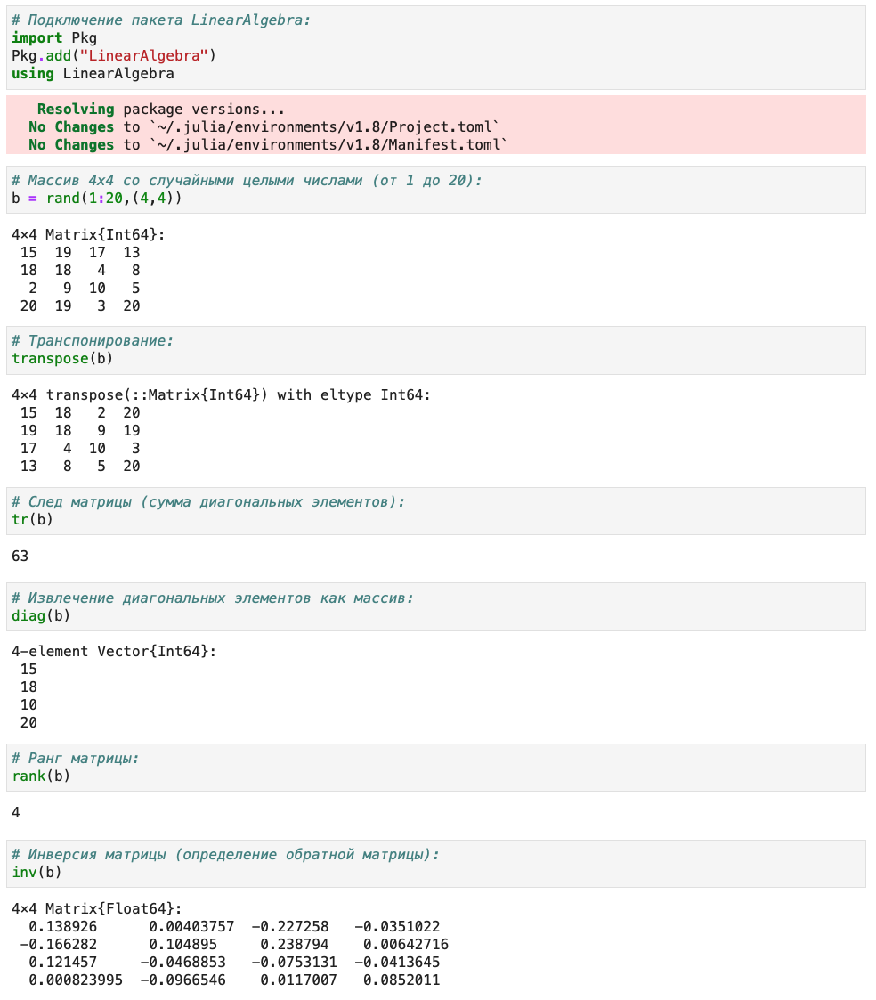
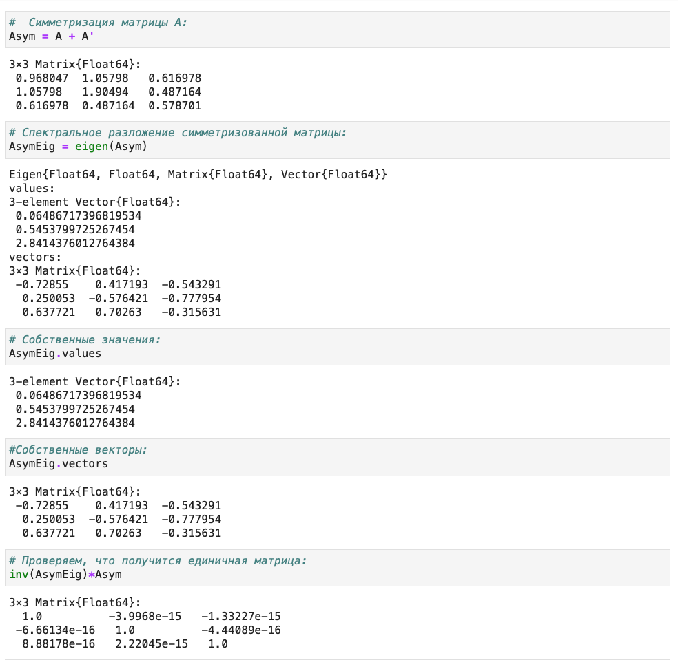

---
## Front matter
lang: ru-RU
title: Защита лабораторной работы №4. Линейная алгебра.
author: Ишанова А.И.
group: NI-402
institute: RUDN University, Moscow, Russian Federation
date: 03 декабря 2022

## Formatting
toc: false
slide_level: 2
theme: metropolis
header-includes: 
 - \metroset{progressbar=frametitle,sectionpage=progressbar,numbering=fraction}
 - '\makeatletter'
 - '\beamer@ignorenonframefalse'
 - '\makeatother'
aspectratio: 43
section-titles: true
---

# Цель выполнения лабораторной работы

Освоить применение циклов функций и сторонних для Julia пакетов для решения задач линейной алгебры и работы с матрицами.

#  Выполнение лабораторной работы

## Повторение примеров - Поэлементные операции над многомерными массивами

Задание 1. Повторение примеров из раздела 4.2.

1. Повторяем примеры с поэлементными операциями над многомерными массивами. (@fig:001 - @fig:002)

## Повторение примеров - Поэлементные операции над многомерными массивами

{ #fig:001 width=65%}

## Повторение примеров - Поэлементные операции над многомерными массивами

{ #fig:002 width=100%}

## Повторение примеров - Транспонирование, след, ранг, определитель и инверсия матрицы

2. Повторяем примеры с операциями над матрицами с пакетом LinearAlgebra (@fig:003 - @fig:004)

## Повторение примеров - Транспонирование, след, ранг, определитель и инверсия матрицы

{ #fig:003 width=55%}

## Повторение примеров - Транспонирование, след, ранг, определитель и инверсия матрицы

{ #fig:004 width=100%}

## Повторение примеров - Вычисление нормы векторов и матриц, повороты, вращения

3. Повторяем примеры из раздела "Вычисление нормы векторов и матриц, повороты, вращения". (@fig:005 - @fig:007)

{ #fig:005 width=80%}

## Повторение примеров - Вычисление нормы векторов и матриц, повороты, вращения

{ #fig:006 width=80%}

## Повторение примеров - Матричное умножение, единичная матрица, скалярное произведение

4. Повторяем примеры из раздела "Матричное умножение, единичная матрица, скалярное произведение". (@fig:007)

{ #fig:007 width=60%}

## Повторение примеров - Факторизация. Специальные матричные структуры

5. Повторяем примеры из раздела "Факторизация. Специальные матричные структуры". (@fig:008 - @fig:017)

{ #fig:008 width=70%}

## Повторение примеров - Факторизация. Специальные матричные структуры

{ #fig:009 width=65%}

## Повторение примеров - Факторизация. Специальные матричные структуры

{ #fig:010 width=100%}

## Повторение примеров - Факторизация. Специальные матричные структуры

{ #fig:011 width=75%}

## Повторение примеров - Факторизация. Специальные матричные структуры

{ #fig:012 width=60%}

## Повторение примеров - Факторизация. Специальные матричные структуры

{ #fig:013 width=50%}

## Повторение примеров - Факторизация. Специальные матричные структуры

{ #fig:014 width=60%}

## Повторение примеров - Факторизация. Специальные матричные структуры

{ #fig:015 width=100%}

## Повторение примеров - Факторизация. Специальные матричные структуры

{ #fig:016 width=75%}

## Повторение примеров - Факторизация. Специальные матричные структуры

{ #fig:017 width=100%}

## Повторение примеров - Общая линейная алгебра

6.  Повторяем примеры из раздела "Общая линейная алгебра". (@fig:018)

{ #fig:018 width=60%}

## Выполнения задания для самостоятельной работы - 1

Задание 2. Выполнение заданий из раздела 4.4.

1. Призведение векторов.

1.1. Задайте вектор v. Умножьте вектор v скалярно сам на себя и сохраните результат в dot_v. (@fig:019)

1.2. Умножьте v матрично на себя (внешнее произведение), присвоив результат переменной outer_v. (@fig:019)

## Выполнения задания для самостоятельной работы - 1

{ #fig:019 width=100%}

## Выполнения задания для самостоятельной работы - 2

2. Системы линейных уравнений.

2.1. Решить СЛАУ с двумя неизвестными.

a) (@fig:020)
$$
\begin{cases}
x+y = 2, \\
x-y=3.
\end{cases}
$$

## Выполнения задания для самостоятельной работы - 2.1

b) Система имеет бесконечно много решений, поэтому программа выдает ошибку. (@fig:020)
$$
\begin{cases}
x+y = 2, \\
2x+2y=4.
\end{cases}
$$

c) Система не имеет решений, поэтому программа выдает ошибку. (@fig:020)
$$
\begin{cases}
x+y = 2, \\
2x+2y=5.
\end{cases}
$$

d) (@fig:021)
$$
\begin{cases}
x+y = 1, \\
2x+2y=2, \\
3x+3y=3.
\end{cases}
$$

## Выполнения задания для самостоятельной работы - 2.1

e) (@fig:021)
$$
\begin{cases}
x+y = 2, \\
2x+y=1, \\
x-y=3.
\end{cases}
$$

f) (@fig:021)
$$
\begin{cases}
x+y = 2, \\
2x+y=1, \\
3x+2y=3.
\end{cases}
$$

## Выполнения задания для самостоятельной работы - 2.1

{ #fig:020 width=60%}

## Выполнения задания для самостоятельной работы - 2.1

{ #fig:021 width=100%}

## Выполнения задания для самостоятельной работы - 2.2

2.2. Решить СЛАУ с тремя неизвестными.

a) (@fig:022)
$$
\begin{cases}
x+y+z = 2, \\
x-y-2z=3.
\end{cases}
$$

b) (@fig:022)
$$
\begin{cases}
x+y+z = 2, \\
2x+2y-3z=4, \\
3x+y+z=1.
\end{cases}
$$

## Выполнения задания для самостоятельной работы - 2.2

c) Система имеет бесконечно много решений, поэтому программа выдает ошибку.(@fig:022)
$$
\begin{cases}
x+y+z = 1, \\
x+y+2z=0, \\
2x+2y+3z=1.
\end{cases}
$$

d) Система не имеет решений, поэтому программа выдает ошибку. (@fig:023)
$$
\begin{cases}
x+y+z = 1, \\
x+y+2z=0, \\
2x+2y+3z=0.
\end{cases}
$$

## Выполнения задания для самостоятельной работы - 2

{ #fig:022 width=80%}

## Выполнения задания для самостоятельной работы - 2.2

{ #fig:023 width=100%}

## Выполнения задания для самостоятельной работы - 3

3. Операции с матрицами.

3.1. Приведите матрицы к диагональному виду.

a) (@fig:024)
$$
\begin{pmatrix}
1 & -2 \\
-2 & 1
\end{pmatrix}
$$

## Выполнения задания для самостоятельной работы - 3.1

b) (@fig:024)
$$
\begin{pmatrix}
1 & -2 \\
-2 & 3
\end{pmatrix}
$$

c) (@fig:024)
$$
\begin{pmatrix}
1 & -2 & 0\\
-2 & 1 & 2 \\
0 & 2 & 0
\end{pmatrix}
$$

## Выполнения задания для самостоятельной работы - 3.1

{ #fig:024 width=100%}

## Выполнения задания для самостоятельной работы - 3.2

3.2. Вычислить:

a) (@fig:025)
$$
\begin{pmatrix}
1 & -2 \\
-2 & 1
\end{pmatrix} ^{10}
$$

b) (@fig:025)
$$
\sqrt{
\begin{pmatrix}
5 & -2 \\
-2 & 5
\end{pmatrix} }
$$

## Выполнения задания для самостоятельной работы - 3.2

c) (@fig:025)
$$
\sqrt[3]{
\begin{pmatrix}
1 & -2 \\
-2 & 1
\end{pmatrix} }
$$

d) (@fig:025)
$$
\sqrt{
\begin{pmatrix}
1 & 2 \\
2 & 3
\end{pmatrix} }
$$

## Выполнения задания для самостоятельной работы - 3.2

{ #fig:025 width=100%}

## Выполнения задания для самостоятельной работы - 3.3

3.3. Найти собственные значения, создать диагональную матрицу из собственных значений и нижнедиагональную матрицу из исходной, оценить эффективность выполнения операций. (@fig:026)

$$
A = 
\begin{pmatrix}
140 & 97 & 74 & 168 & 131 \\
97 & 106 & 89 & 131 & 36 \\
74 & 89 & 152 & 144 & 71 \\
168 & 131 & 144 & 54 & 142 \\
131 & 36 & 71 & 142 & 36
\end{pmatrix}
$$

## Выполнения задания для самостоятельной работы - 3.3

{ #fig:026 width=70%}

## Выполнения задания для самостоятельной работы - 4

4. Линейные модели экономики. 

Линейная модель:

$$ x- Ax = y$$

Проверить являются ли матрицы A продуктивными по критерию:

## Выполнения задания для самостоятельной работы - 4.1

4.1. Критерий: Решение системы х при любом неотрицательном y имеет только неотрицательные элементы.

a) (@fig:027)
$$
\begin{pmatrix}
1 & 2 \\
3 & 4
\end{pmatrix}
$$

b)(@fig:027)
$$ \frac{1}{2}
\begin{pmatrix}
1 & 2 \\
3 & 4
\end{pmatrix}
$$

c)(@fig:027)
$$ \frac{1}{10}
\begin{pmatrix}
1 & 2 \\
3 & 4
\end{pmatrix}
$$

## Выполнения задания для самостоятельной работы - 4.1

{ #fig:027 width=100%}

## Выполнения задания для самостоятельной работы - 4.2

4.2. Все элементы матрицы $(E-A)^{-1}$ - неотрицательные числа.

a) (@fig:028)
$$
\begin{pmatrix}
1 & 2 \\
3 & 1
\end{pmatrix}
$$

b)(@fig:028)
$$ \frac{1}{2}
\begin{pmatrix}
1 & 2 \\
3 & 1
\end{pmatrix}
$$

c)(@fig:028)
$$ \frac{1}{10}
\begin{pmatrix}
1 & 2 \\
3 & 1
\end{pmatrix}
$$

## Выполнения задания для самостоятельной работы - 4.2

{ #fig:028 width=100%}

## Выполнения задания для самостоятельной работы - 4.3

4.3. Все собственные значения матрицы А по модулю меньше 1.

a) (@fig:029)
$$
\begin{pmatrix}
1 & 2 \\
3 & 1
\end{pmatrix}
$$

b)(@fig:029)
$$ \frac{1}{2}
\begin{pmatrix}
1 & 2 \\
3 & 1
\end{pmatrix}
$$

## Выполнения задания для самостоятельной работы - 4.3

c)(@fig:029)
$$ \frac{1}{10}
\begin{pmatrix}
1 & 2 \\
3 & 1
\end{pmatrix}
$$

d)(@fig:029)
$$
\begin{pmatrix}
0.1 & 0.2 & 0.3 \\
0 & 0.1 & 0.2 \\
0 & 0.1 & 0.3
\end{pmatrix}
$$

## Выполнения задания для самостоятельной работы - 4.3

{ #fig:029 width=100%}

# Результаты выполнения лабораторной работы

- ознакомились с:
  - поэлементными операциями над многомерными массивами
  - операциями транспонирования, следа, ранга, определителя и инверсии матрицы
  - функциями вычисления норм векторов и матриц, поворотами, вращениями
  - функциями матричного и скалярного умножений
  - способом задания единичной матрицы
  - разными факторизациями матриц (LU, LUP, QR, спектральное)
  - специальнми матричными структурами
  - способом оценки эффективности
  - работой в линейной алгебре с рациональными числами

## Результаты выполнения лабораторной работы

- с помощью полученных знаний решили задания для самостоятельной работы
- получили файл с лабораторной в формате ipynb, который может быть использован в качестве референса для последующих работ на языке Julia